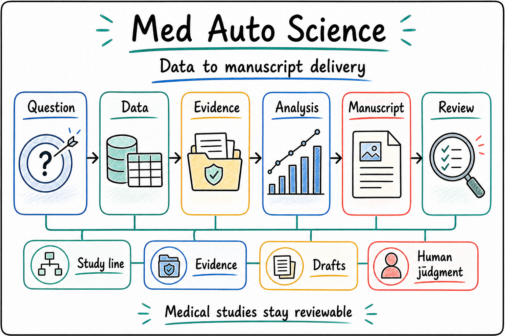

  

  <a href="./README.md"><strong>English</strong></a> | <a href="./README.zh-CN.md">中文</a>

<!--
Owner: MedAutoScience
Purpose: public repository entry
State: current_public_entry
Machine boundary: Human-readable public entry only. Machine truth remains in agent/, contracts, source, CLI/MCP/API behavior, product-entry manifests, domain-handler receipts, runtime/controller durable surfaces, study workspace artifacts, and owner receipts.
-->

<h1 align="center">Med Auto Science</h1>

<strong>An AI research agent for real medical studies, built to turn data, evidence, and drafts into manuscript-ready work</strong>

Disease Studies · Evidence Building · Analysis Support · Manuscript Delivery

<table>
  <tr>
    <td width="33%" valign="top">
      <strong>Who It Serves</strong> 
      Clinicians, PIs, and medical research teams working with disease-specific data and moving studies toward manuscripts
    </td>
    <td width="33%" valign="top">
      <strong>What It Organizes</strong> 
      Study questions, data assets, analysis progress, evidence gaps, and manuscript-facing files inside one governed workspace
    </td>
    <td width="33%" valign="top">
      <strong>How To Start</strong> 
      Tell it the disease area, the dataset you have, the question you want to answer, and the paper outcome you want
    </td>
  </tr>
</table>

  

> `Med Auto Science` is for teams already doing real medical research. It keeps study questions, data, analyses, evidence, drafts, and delivery files connected on one governed study line so the work can keep moving and stay reviewable.

## Why Med Auto Science

The hard part of medical research is rarely a single paragraph. It is moving a study from data and ideas toward a paper that can be reviewed, revised, and submitted.

Medical teams often run into the same problems:

- You have data, but it is not clear which question is worth pursuing.
- You have preliminary results, but they do not yet form one manuscript line.
- Figures, drafts, analysis notes, and validation results drift across folders and conversations.
- Review, extra analysis, claim revision, and delivery files overlap until progress is hard to explain.
- Multiple disease studies run in parallel, and key evidence or decisions can be lost.

**Med Auto Science is built around those research problems.**

It organizes a medical study as a research line: frame the valuable question, prepare the data and evidence, advance analysis and validation, build the manuscript story, and keep paper-facing files ready for review and delivery.

It does not treat medical research as a rigid pipeline. A study can start with several possible directions, return to data and evidence for comparison, and gradually converge into a clearer manuscript line. AI keeps the work moving, organized, and revised; researchers keep clinical framing, claim acceptance, and final submission judgment.

## One-Sentence Quick Start

You can start with prompts like:

- "Help me find a paper-worthy question from this colorectal cancer dataset, tell me what evidence is still missing, and propose the next step."
- "I already have preliminary results. Turn them into one manuscript line and tell me what validation to do next."
- "Keep pushing this disease study toward a publishable paper, and keep the progress plus files organized as we go."

## Core Highlights

<table width="100%">
<tr>
<td width="50%" valign="top">

**Identify paper-worthy questions from data**

Start with a disease cohort, registry, or real-world dataset, then identify questions with clinical value, evidence support, and manuscript potential before piling up analyses.

</td>
<td width="50%" valign="top">

**Turn scattered results into a manuscript line**

Existing analyses, early findings, figures, and drafts are organized into a clearer research story with explicit next evidence steps.

</td>
</tr>
<tr>
<td width="50%" valign="top">

**Keep progress and delivery files together**

Tasks, files, figures, drafts, validation notes, and deliverables stay tied to the same study workspace so the line remains reviewable and easy to continue.

</td>
<td width="50%" valign="top">

**Let AI do the heavy lifting while researchers keep judgment**

AI can help prepare data, run analyses, organize evidence, and report progress. Clinical framing, claim acceptance, and final submission decisions stay with researchers and PIs.

**Compare, revise, and review repeatedly**

Medical papers do not finish in one generation. The system can keep multiple claims, evidence gaps, analysis routes, and review findings on the same research line, then keep producing the next more-reviewable manuscript and evidence package.

</td>
</tr>
</table>

## What It Helps With

- Finding a study question worth continuing from a disease-specific dataset, registry, or cohort.
- Turning existing analyses and early results into one manuscript line.
- Managing validation, subgroup analysis, calibration, clinical utility analysis, and other supporting evidence.
- Keeping multiple related studies organized in one workspace.
- Keeping paper-facing results, figures, drafts, and delivery files tied to their study.

## Current Position And Boundary

- `Med Auto Science` is the medical research Foundry Agent for turning disease data, study questions, evidence, and manuscript work into one governed research line.
- It can be used as the Research Foundry inside One Person Lab, and it can also be called directly by Codex or another agent through stable capability entries.
- MAS owns the medical work itself: study questions, evidence organization, manuscript direction, manuscript quality, and delivery materials. One Person Lab handles hosted runtime, progress display, recovery/retry, and the cross-agent product entry.
- Manuscript quality is governed by study charters, evidence ledgers, review records, AI reviewer workflow, publication gates, and controller records. Status panels and script checks provide supporting evidence.
- Clinical framing, claim acceptance, and final submission decisions stay with researchers and PIs.
- Journal submission and external system interaction stay under human supervision.

  
<strong>Technical boundary for operators</strong>

- `Med Auto Science` is a medical research domain agent and Foundry Agent. It can be called directly by Codex, and it can also be discovered and hosted as an OPL-compatible package under `OPL Framework`.
- MAS owns the medical work itself: study intake, workspace context, evidence progression, progress explanation, manuscript quality judgment, runtime-facing owner receipts/projections, artifact authority, and manuscript-facing delivery.
- `OPL Framework` is the upper stage-led framework. It owns the generic runtime platform: stage attempts, queues, wakeups, recovery, approvals, receipts, state-machine execution, and cross-domain projection. MAS keeps medical conclusions, manuscript quality, domain transition semantics, artifact authority, and submission-facing judgment.
- In the OPL framework, a `Stage` is a large task step such as scouting, analysis, writing, reviewer repair, or delivery. An Agent executor is the minimum execution unit inside a stage; `Codex CLI` is the current first-class executor.
- A MAS stage pack gives the executor a goal, context, authority boundary, available affordances, knowledge refs, and quality gate. During the attempt, the executor decides what to read first, which tools to call, whether to run in parallel, whether to generate multiple candidates, and when to route back or request a reviewer; OPL route orchestration does not pre-script that reasoning.
- MAS tool declarations follow a Tool Affordance Boundary: they declare capability, permission, credential boundary, write scope, side effects, forbidden authority, and evidence entry points. They do not freeze the executor's literature reading, statistical checks, candidate generation, route comparison, or question-asking order into an out-of-prompt workflow script.
- MAS has completed monolith closeout. `MedDeepScientist` / `DeepScientist` remains available as provenance, explicit archive import, backend audit, upstream learning, and parity reference.
- Long-running OPL-hosted production execution is Temporal-backed. Temporal is the required production provider for OPL durable stage attempts, signal/query, retry/dead-letter, and workflow history. `Hermes-Agent` is not the target session/wakeup substrate, but it remains available as an explicit Agent executor adapter / proof lane that promises connectivity and auditability, not behavior or quality equivalence with `Codex CLI`.

## How To Read This Repository

1. Potential users and medical experts should start here, then continue to the [Docs Guide](./docs/README.md).
2. Technical readers and planners should read [Project](./docs/project.md), [Status](./docs/status.md), [Architecture](./docs/architecture.md), [Invariants](./docs/invariants.md), and [Decisions](./docs/decisions.md).
3. Developers and maintainers should continue from the [Docs Guide](./docs/README.md) into `docs/active/`, `docs/runtime/`, `docs/delivery/`, `docs/references/`, and `docs/policies/`.

## Agent And Operator Quick Start

  
<strong>Start here if you are handing this repo to Codex or another agent</strong>

- No. Cloning this repo does not auto-install OPL Framework or the production runtime. To make MAS usable, first make the current `one-person-lab` checkout or release bundle available, then use `medautosci product skill-catalog --profile <profile> --format json` to inspect the skill or `medautosci domain-handler export --profile <profile> --format json` to hand off to OPL or Codex.
- Read the [Docs Guide](./docs/README.md) first. It maps the current product boundary, operator entry surfaces, and the technical reading order.
- If you need to bootstrap or take over a disease workspace, read [Bootstrap](./bootstrap/README.md) next. It explains the workspace-first model and the `init-workspace -> doctor -> show-profile -> bootstrap` path.
- Treat [Project](./docs/project.md), [Status](./docs/status.md), [Architecture](./docs/architecture.md), [Invariants](./docs/invariants.md), and [Decisions](./docs/decisions.md) as the repo-tracked human-readable truth set before changing runtime or docs.
- The current operator entry surfaces are discoverable as `CLI`, `MCP`, `product-entry`, and `controller`, but their generic descriptors and hosted shells are owned by OPL generated/hosted surfaces. The repo-root `agent/` pack is the generated-interface semantic source for OPL; local entry code only serves MAS domain handler targets, medical authority functions, owner receipt / typed blocker producers, or refs-only projections.
- MAS can be invoked directly through its Codex app skill or through OPL. Both routes use the same MAS-owned stage, controller, durable truth, and artifact surfaces; OPL/Temporal is the default hosted autonomous runtime for durable scheduling, wakeup, retry, resume, and projection.
- New disease workspaces are no-root-Git / no-quest-Git by default. OPL owns runtime lifecycle, provider attempts, wakeup, retry, and resume state; MAS only exposes domain refs, restore/provenance locators, artifact authority, owner receipts, typed blockers, and human gates.
- When an external agent needs the repo-tracked MAS skill surface directly, use `medautosci product skill-catalog --profile <profile> --format json`; it returns the single MAS app skill, the underlying command contracts, and body-free owner-route / artifact / authority refs for OPL or direct Codex execution.
- For OPL Full online handoff, `medautosci domain-handler export --profile <profile> --format json` exposes body-free owner-route refs and `medautosci domain-handler dispatch --task <task.json> --format json` records MAS owner-route dispatch receipts. OPL owns stage graph hydration, queue, attempt ledger, retry/dead-letter, and provider readiness; MAS owner surfaces only return receipts, typed blockers, human gates, or domain refs.

## Further Reading

- [Docs Guide](./docs/README.md)
- [Project](./docs/project.md)
- [Status](./docs/status.md)
- [Architecture](./docs/architecture.md)
- [Invariants](./docs/invariants.md)
- [Decisions](./docs/decisions.md)
