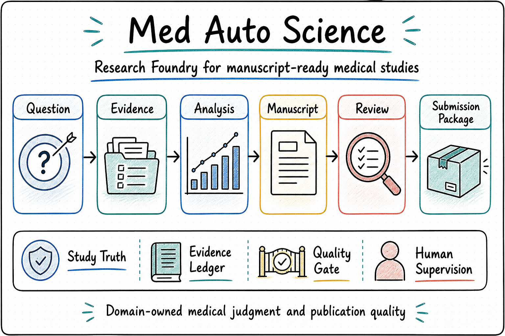

<p align="center">
  
</p>

<p align="center">
  <a href="./README.md">English</a> | <a href="./README.zh-CN.md"><strong>中文</strong></a>
</p>

<h1 align="center">Med Auto Science 医学自动科研平台</h1>

<p align="center"><strong>Research Foundry 的首个成熟医学实现</strong></p>
<p align="center">Clinical Research Progression · Evidence Packaging · Submission Delivery</p>

<table>
  <tr>
    <td width="33%" valign="top">
      <strong>面向谁</strong><br/>
      从专病数据出发、希望把研究稳定推进到论文交付的医学团队与研究者
    </td>
    <td width="33%" valign="top">
      <strong>对外角色</strong><br/>
      共享 `Unified Harness Engineering Substrate` 之上的医学 `Research Ops` gateway 与 `Domain Harness OS`
    </td>
    <td width="33%" valign="top">
      <strong>在联邦中的位置</strong><br/>
      <code>One Person Lab -> Research Foundry -> Med Auto Science</code>
    </td>
  </tr>
</table>

<p align="center">
  
</p>

> 对外，`Med Auto Science` 是 `Research Foundry` 主线中的医学 `Research Ops` gateway；对内，它是共享 `Unified Harness Engineering Substrate` 之上的医学 `Research Ops` `Domain Harness OS`。

## 对外一句话理解

如果你的目标是把专病数据持续推进成可投稿的正式研究，`Med Auto Science` 提供的不是零散脚本，而是一条可治理、可审计、可持续推进的医学研究主线。

## 它处在什么位置

`Med Auto Science` 不是 `Research Foundry` 的全部本体，也不是顶层的 `OPL` gateway。

它当前承担的是：

- `Research Foundry` 主线上的首个成熟医学实现
- `Research Ops` 在医学场景下的 active carrier
- 负责医学 `Research Ops` 的领域合同与交付要求
- 负责组织医学课题、证据包与投稿交付的 domain gateway
- 共享 `Unified Harness Engineering Substrate` 之上的医学 `Research Ops` `Domain Harness OS`
- 位于受控 `MedDeepScientist` 执行 surface 之上的 harness 化运行面，但不把 `MedDeepScientist` 视为系统本体

公开链路可以概括为：

`User / Agent -> OPL Gateway（可选顶层）-> Unified Harness Engineering Substrate -> Research Foundry -> Med Auto Science -> 受控 MedDeepScientist surface`

## 它能帮你做什么

- 把专病级 workspace、数据资产、study 组合和交付物组织在同一个可审计表面上。
- 把课题从数据清洗、资产登记推进到分析、验证、证据组织和稿件交付。
- 让研究逻辑更贴近临床读者与期刊写作要求，而不是默认退化成通用 ML 论文结构。
- 对论文图表、表格和 submission surface 施加更严格的结构化约束。

## 它为什么存在

很多自动科研系统更擅长“把流程跑完”，但不擅长控制论文质量。

`Med Auto Science` 的优先级不同：

- 先判断一个方向是否值得继续投入，而不是默认把预算花完
- 先围绕临床意义、报告逻辑和证据链组织研究
- 先把关键状态落到可审计表面，而不是藏在瞬时会话里
- 让 Agent 负责执行，把关键继续/停止判断保留给人类

## 当前默认运行形态

当前默认是本地 `Codex-default host-agent runtime`。
其 formal-entry matrix 已固定为：默认正式入口 `CLI`、支持协议层 `MCP`、内部控制面 `controller`。
这套矩阵描述的是 Agent 如何进入 runtime，并不意味着公开产品被重新定义成“给医学用户手工敲命令”的工具箱。
当前 repo-tracked 产品主线按 `Auto-only` 理解；未来如果要做 `Human-in-the-loop` 产品，应作为兼容 sibling 或 upper-layer product 复用同一 substrate，而不是把当前仓改成同仓双模。
在该形态下，运行由受控 `MedDeepScientist` surface 推进，这意味着：

- `Med Auto Science` 仍是该领域的 `Domain Harness OS` 与 contract owner
- `MedDeepScientist` 是执行 surface，不是系统本体

## 当前仓库侧状态

当前 repo-tracked runtime 主线已经通过 integration-harness closeout 吸收到仓库主线。
当前最诚实的 repo-side 停车结论是 `EXTERNAL_RUNTIME_DEPENDENCY_BLOCKED_AFTER_ABSORB`。

这意味着：

- 仓库已经承载当前 runtime contract、durable surfaces 与 cutover-readiness 阻塞包
- 下一步不是重新打开新的仓内架构 tranche
- 真实继续推进仍依赖 external runtime / workspace gate 与剩余的 human-required interaction

## 运行句柄与持久表面

- `study_id`：医学 study 的持久聚合根身份。
- `quest_id`：绑定到该 study 的受控 `MedDeepScientist` managed quest 正式运行句柄。
- `active_run_id`：当前 quest 内 live daemon run 的细粒度执行句柄；它不能取代 `study_id` 或 `quest_id`。
- `program_id`：当前 `research-foundry-medical-mainline` 的 control-plane / report-routing 指针。
- 当前 canonical durable status / audit / decision surface：`study_runtime_status`、`runtime_watch`、`artifacts/publication_eval/latest.json`、`artifacts/reports/escalation/runtime_escalation_record.json`、`artifacts/controller_decisions/latest.json`、`artifacts/runtime/last_launch_report.json`。
- repo-tracked runtime truth 与本地 operator handoff surface 必须分开：前者负责产品/runtime 合同，后者只负责机器本地恢复与 continuation 状态。

## 未来托管形态下的不变项

即使未来迁移到同一底座上的 managed web runtime，下列核心口径保持不变：

- 人类可审计的状态与决策链
- 医学领域合同（数据、课题推进、证据组织、投稿交付）
- 领域层与执行引擎之间的受控边界

## 医学论文展示面是长期稳定的发表交付层

论文展示面现在应被理解为长期稳定的 publication-facing layer，而不是某个短期阶段标签。

这套系统的目标是保住论文图表与表格的下限，但不限制针对具体课题做上限优化。平台约束的不只是配色或外观，而是版式边界、字段组织、导出结构和质量检查。像文字重叠、注释越界、子图难读、复合 panel 失衡这类低级问题，会被当作 contract / QC 问题处理，而不是留到人工临时补救。

现在这条展示主线有三层分工：

- 顶层目标：用 `A-H` 八大类 paper family 定义长期路线
- 工程审计：用 audited audit families 管理 schema、renderer、QC 与 materialization
- 具体库存：用 template catalog 记录当前已经正式注册的模板、壳层与表格

这意味着：

- roadmap 负责回答“平台最终要覆盖哪些常见医学论文证据家族”
- audit guide 负责回答“当前哪些模板已经严格 audited”
- template catalog 负责回答“代码里现在到底注册了哪些模板与 contract”

如果你想继续从维护中的文档入口往下读，优先查看：

- [公开文档索引](docs/README.zh-CN.md)

展示路线图、审计指南和模板目录这类细节文档当前仍按仓库跟踪的操作文档维护；除非被显式提升到双语公开面，否则默认不扩成双语正文。

## 典型交付结果

如果一个课题值得继续推进，平台的目标是帮助你得到：

- 值得继续投入的研究方向，而不是一次性运行记录
- 可追踪、可扩展的数据资产
- 在病种 workspace 内按 study 管理的结果包
- 面向稿件与投稿的证据组织
- 论文、补充材料和 submission package

## 更适合的课题形态

`Med Auto Science` 特别适合下面这些场景：

- 你已经有一个专病队列，或一批稳定的临床数据
- 你希望多个课题复用同一个 workspace 和数据底座
- 论文需要外部验证、亚组分析、校准、临床效用或机制 sidecar
- 最终目标不只是分析结果，而是完整稿件与投稿交付

## 最快开始方式：通过你的 Agent

对大多数医学用户来说，最快的方式是先把目标、数据和约束交给 Agent，再让它调用 `Med Auto Science`。

但针对真实课题继续推进，需要先明确一个边界：repo-side baseline 已经准备好，是否能继续 end-to-end 推进仍取决于 `docs/program/external_runtime_dependency_gate.md` 中定义的 external runtime / workspace gate package。

通常只需要三步：

1. 选择或创建一个病种级 workspace，把原始数据、变量字典、终点定义、纳排标准和参考文章放进去。
2. 让 Agent 先把这些数据整理成机读、可审计的研究资产。
3. 再让 Agent 用 `Med Auto Science` 作为医学 `Research Ops` gateway 推进课题，并把目标期刊、重点终点、亚组要求和其他发表约束一起带入运行链路。

你可以直接把下面这段话发给 Agent：

> 请先读取我放在这个研究目录中的数据和说明文档。第一步，把数据清洗并登记为机读、可审计的研究资产，明确变量定义、终点定义和可用范围。第二步，使用 Med Auto Science（`https://github.com/gaofeng21cn/med-autoscience`）作为共享 `Unified Harness Engineering Substrate` 上的医学 `Research Ops` `Domain Harness OS`，通过受控 MedDeepScientist surface 推进课题，形成发表级证据链、图表表格、稿件表面和投稿材料。请把我提供的目标期刊、终点优先级、亚组要求和其他约束一并带入运行 contract。优先判断课题是否值得继续投入；若方向偏弱，请止损、改题或补充合适 sidecar。

## 文档入口

- [文档索引](docs/README.zh-CN.md)

更细的操作文档继续保留在仓库中，但默认属于内部中文文档；只有被提升到双语公开面时，才会同步补齐英文与中文镜像。

## 技术验证

开发与验证建议使用仓库内 `uv` 环境：

```bash
uv sync --frozen --group dev
make test-full
uv run python -m build --sdist --wheel
```

本地测试分层入口：

- `make test-fast`：默认开发切片，排除 meta-only 与 display-heavy 套件
- `make test-meta`：repo-tracked 文档、workflow、打包与 contract surface 检查
- `make test-display`：display materialization 与 golden regression 套件
- `make test-full`：clean-clone 基线使用的完整验证入口

如果你主要通过 Codex 接入，优先查看：

- [Codex plugin 接入](docs/references/codex_plugin.md)
- [Codex plugin 发布说明](docs/references/codex_plugin_release.md)
