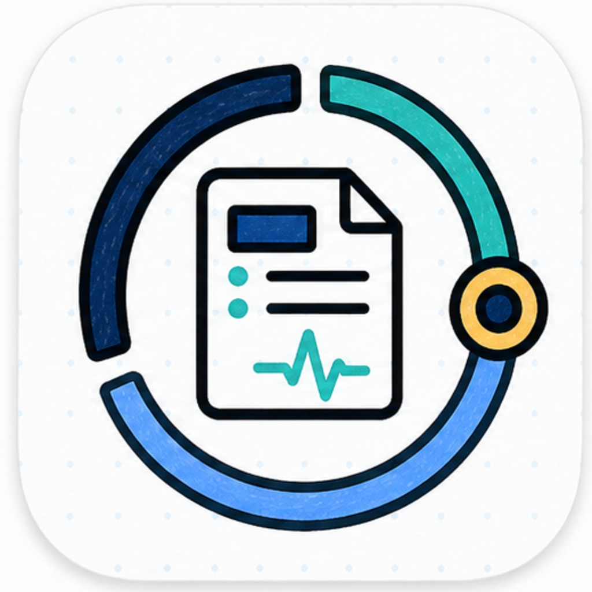

  

  <a href="./README.md">English</a> | <a href="./README.zh-CN.md"><strong>中文</strong></a>

<h1 align="center">Med Auto Science 医学自动科研平台</h1>

<strong>可被直接调用的独立医学研究 domain agent 与单一 MAS app skill，用来把数据、课题和证据持续推进到论文交付</strong>

专病研究 · 证据组织 · 论文交付

<table>
  <tr>
    <td width="33%" valign="top">
      <strong>适用人群</strong> 
      持有专病队列、临床数据库或多模态研究数据，准备持续推进课题的医生、课题负责人与医学研究团队
    </td>
    <td width="33%" valign="top">
      <strong>适用问题</strong> 
      题目、数据、分析结果和草稿分散在多处，希望把研究主线、进度和交付物收在同一个工作区里
    </td>
    <td width="33%" valign="top">
      <strong>如何开始</strong> 
      直接说明病种、数据、目标问题和希望形成的论文结果，系统就可以开始整理研究路径
    </td>
  </tr>
</table>

  

> `Med Auto Science` 面向已经进入真实研究阶段的团队。它把选题、数据整理、证据推进、进度反馈和论文相关文件放在同一条主线上，便于持续推进和审阅。

## 一句话快速启动

你可以直接这样说：

- “帮我用这批结直肠癌数据找一个值得投稿的题目，先判断最有价值的问题是什么，还缺哪些证据。”
- “我已经做过初步分析了，帮我把结果收成一条论文主线，并告诉我下一步先补什么验证。”
- “围绕这个专病课题继续往前推，目标是形成一篇能投稿的论文，过程里的进度和文件都帮我整理好。”

## 适合处理的工作

- 从一批专病数据、注册库或队列里筛出值得继续推进的研究问题。
- 把已有分析结果和早期发现收成一条更完整的论文主线，并明确下一步证据。
- 在同一个工作区里持续推进多个相关课题，减少文件、图表、草稿和决策记录的分散。
- 把验证、亚组、校准、临床效用等补充证据放在同一条研究线上管理。
- 让论文相关结果、图表、草稿和交付文件持续绑定到对应课题。

## 工作方式

- 研究者提供临床问题、数据、约束条件和最终判断。
- AI 助手推进数据整理、分析执行、证据组织和进度反馈。
- 工作区持续保存任务、文件、进度和交付物，方便回看和审阅。

## 当前定位与边界

- `Med Auto Science` 是医学研究领域智能体，可以由 Codex 直接调用，也可以接入 `OPL` 的统一智能体运行框架。
- MAS 负责医学研究本身：课题进入、工作区语境、证据推进、进度说明、论文质量判断和稿件交付。
- `OPL` 是上层运行框架：负责任务阶段、队列、唤醒、恢复、审批、记录和跨领域状态展示；医学结论、论文质量和投稿判断由 MAS 的医学研究面继续持有。
- 在 OPL 框架里，`Stage` 表示一次较大的研究步骤，例如选题、分析、写作、审稿修复或交付；`Codex CLI` 是 stage 内默认的最小执行单元。
- MAS 已完成单仓收敛。`MedDeepScientist` / `DeepScientist` 现在作为历史来源、显式归档导入、后端审计、上游学习和能力对照材料保留。
- 长期在线能力按 OPL 的 provider-backed runtime 方向推进，Temporal 是目标生产 provider；`Hermes-Agent` 在迁移期作为可选 provider、证明线或历史兼容材料保留。
- 论文质量由 MAS 的 study charter、证据账本、审阅账本、AI reviewer、publication gate 和控制面记录共同约束；状态面板、脚本检查和历史 MDS 覆盖率只提供辅助证据。
- 临床问题界定、结论采用和最终投稿决策由研究者与课题负责人把关。
- 期刊投稿和外部系统交互由人工监督完成。

## 这个仓库应该怎么读

1. 潜在用户、医生和医学专家先看当前首页，再继续看 [文档索引](./docs/README.zh-CN.md)。
2. 技术规划、架构判断和方向同步，继续读 [项目概览](./docs/project.md)、[当前状态](./docs/status.md)、[架构](./docs/architecture.md)、[不可变约束](./docs/invariants.md)、[关键决策](./docs/decisions.md)。
3. 开发者和维护者继续从 [文档索引](./docs/README.zh-CN.md) 进入 `docs/runtime/`、`docs/program/`、`docs/capabilities/`、`docs/references/` 与 `docs/policies/`。

## 给 Agent 和技术操作者的快速入口

  
<strong>如果你准备把这个仓直接交给 Codex 或其他 Agent，先看这里</strong>

- 先读 [文档索引](./docs/README.zh-CN.md)。这里已经把当前产品边界、operator entry surface 和技术阅读顺序列清楚了。
- 如果你要接管或初始化一个专病 workspace，下一跳读 [Bootstrap](./bootstrap/README.md)。它说明了 workspace-first 心智模型，以及 `init-workspace -> doctor -> show-profile -> bootstrap` 这条最短接管路径。
- 在改 runtime、入口表述或 docs 之前，把 [项目概览](./docs/project.md)、[当前状态](./docs/status.md)、[架构](./docs/architecture.md)、[不可变约束](./docs/invariants.md) 和 [关键决策](./docs/decisions.md) 当成人工可读的 repo-tracked 真相集。
- 当前正式 operator entry surfaces 是 `CLI`、`MCP`、`product-entry` 和 `controller`。产品入口与运行时合同主要放在 `docs/runtime/` 和 `docs/program/`，Agent 可以直接从这些文档切入，不必先通读代码；稳定可调用面继续是本地 CLI、MCP tools、product-entry surface、controller-authorized workspace commands / scripts、durable surface 与 repo-tracked contract。
- MAS 可以通过 Codex app skill 直接调用，也可以通过 OPL 托管调用。两条路径共同使用 MAS-owned stage、controller、durable truth 和 artifact surface；OPL framework metadata 只作为运行框架层的索引、唤醒、恢复和投影信息。
- 如果外部 agent 需要直接读取 repo-tracked 的 MAS skill surface，用 `medautosci product skill-catalog --profile <profile> --format json`；返回的是单一 MAS app skill、底层 command contracts，以及由现有 runtime/session/progress/artifact surface 投影出的 machine-readable `runtime_continuity` envelope。
- OPL Full online runtime 集成使用 `medautosci sidecar export --profile <profile> --format json` 和 `medautosci sidecar dispatch --task <task.json> --format json`。本地 CLI/status/manifest 可用于诊断 provider readiness；OPL provider 暂不可用时，状态面应明确报告 degraded online readiness。

## 延伸阅读

- [文档索引](./docs/README.zh-CN.md)
- [项目概览](./docs/project.md)
- [当前状态](./docs/status.md)
- [架构](./docs/architecture.md)
- [不可变约束](./docs/invariants.md)
- [关键决策](./docs/decisions.md)
