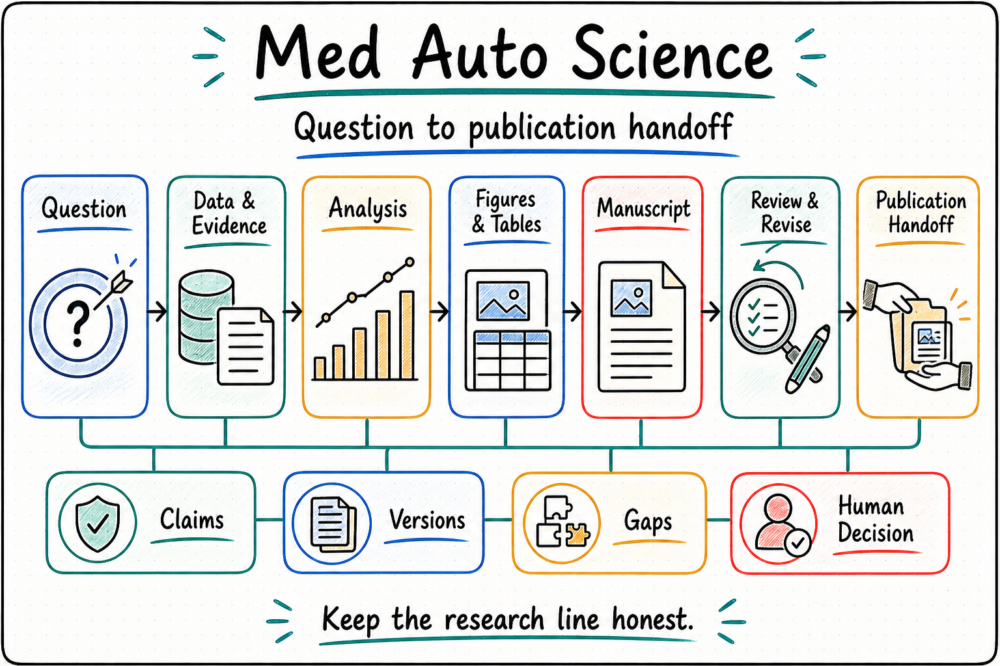

  

  <a href="./README.md">English</a> | <a href="./README.zh-CN.md"><strong>中文</strong></a>

<!--
Owner: MedAutoScience
Purpose: public repository entry
State: current_public_entry
Machine boundary: Human-readable public entry only. Machine truth remains in agent/, contracts, MAS domain-handler/authority results, OPL generated/readback surfaces, study workspace artifacts, and owner receipts.
-->

<h1 align="center">Med Auto Science 医学自动科研平台</h1>

<strong>面向真实医学研究的 AI 科研助手 —— 把数据、证据和写作持续推进到论文交付</strong>

专病研究 · 证据整理 · 分析推进 · 论文交付

<table>
  <tr>
    <td width="33%" valign="top">
      <strong>适用人群</strong> 
      持有专病队列、临床数据库或多模态研究数据，准备持续推进课题的医生、课题负责人与医学研究团队
    </td>
    <td width="33%" valign="top">
      <strong>适用问题</strong> 
      题目、数据、分析结果和草稿分散在多处，希望把研究主线、进度和交付物收在同一个工作区里
    </td>
    <td width="33%" valign="top">
      <strong>如何开始</strong> 
      直接说明病种、数据、目标问题和希望形成的论文结果，系统就可以开始整理研究路径
    </td>
  </tr>
</table>

  

> `Med Auto Science` 面向已经进入真实研究阶段的团队。它把选题、数据、分析、证据、草稿和交付文件收在同一条研究线上，让课题可以持续推进、回看和审阅。

## 为什么是 Med Auto Science

医学科研真正难的往往不是写一段文字，而是把一个课题从数据和想法一路推到可投稿的论文。这个过程中，经常会遇到这些问题：

- 有数据，但不知道哪个问题最值得继续做。
- 已经跑出一些结果，却很难收成一条清晰论文主线。
- 图表、草稿、分析记录和补充验证散落在不同地方。
- 审稿、补分析、修结论和交付文件反复穿插，进度很难讲清楚。
- 多个专病课题并行推进时，容易丢失关键证据和决策理由。

**Med Auto Science 正是围绕这些医学研究问题设计的。**

它把一个医学课题组织成持续推进的研究线：先判断问题价值，再整理数据和证据，推进分析与验证，形成稿件主线，最后把论文相关文件收口到可审阅、可交付的状态。

它不会把医学研究当成一条死板流程。一个课题可以先形成多个可能方向，再回到数据和证据里比较，逐步收成更清楚的论文主线。AI 负责持续推进、整理和改写；研究者负责临床问题、结论采用和最终投稿判断。

## 一句话快速启动

你可以直接这样说：

- “帮我用这批结直肠癌数据找一个值得投稿的题目，先判断最有价值的问题是什么，还缺哪些证据。”
- “我已经做过初步分析了，帮我把结果收成一条论文主线，并告诉我下一步先补什么验证。”
- “围绕这个专病课题继续往前推，目标是形成一篇能投稿的论文，过程里的进度和文件都帮我整理好。”

## 核心亮点

<table width="100%">
<tr>
<td width="50%" valign="top">

**从数据中找到值得写的题目**

围绕专病队列、注册库或真实世界数据，先判断哪些问题有临床价值、证据基础和论文潜力，而不是直接堆分析。

</td>
<td width="50%" valign="top">

**把零散结果收成论文主线**

把已有分析、早期发现、图表和草稿组织成一条更清楚的研究故事，并明确下一步最该补哪些证据。

</td>
</tr>
<tr>
<td width="50%" valign="top">

**长期保存研究进度和交付文件**

课题的任务、文件、图表、草稿、验证记录和交付物持续绑定到同一工作区，方便回看、审阅和接力。

</td>
<td width="50%" valign="top">

**让 AI 做推进，研究者做关键判断**

AI 可以协助整理数据、执行分析、组织证据和汇报进度；临床问题界定、结论采用和投稿决策仍由研究者与课题负责人把关。

**能反复比较、修订和审阅**

医学论文不是一次生成就结束。系统可以把多个研究主张、证据缺口、分析路线和审阅意见放在同一条研究线上反复比较，持续形成下一版更可审阅的稿件和证据包。

</td>
</tr>
</table>

## 适合处理的工作

- 从一批专病数据、注册库或队列里筛出值得继续推进的研究问题。
- 把已有分析结果和早期发现收成一条更完整的论文主线。
- 管理验证、亚组、校准、临床效用等补充证据。
- 在同一个工作区里持续推进多个相关课题。
- 把论文相关结果、图表、草稿和交付文件持续绑定到对应课题。
- 在同一课题阶段里比较研究主张、证据缺口、分析路线和审阅意见，持续形成下一版稿件与证据包。

## 当前定位与边界

- `Med Auto Science` 是医学研究 Foundry Agent，负责把专病数据、研究问题、证据和论文工作收在同一条可治理研究线上。
- 在 OPL family 中，MAS 是 `OPL Package(kind=agent)`：MAS 保留医学领域 authority，OPL 持有通用 runtime 与 hosted surface。Package identity、capabilities、依赖、科研 Work Item 与 typed views 不绑定单一 carrier 或 executor。
- 它可以作为 One Person Lab 里的研究工坊使用，也可以由 Codex 或其他 Agent 直接调用稳定能力入口。
- 当前正式路径优先使用 Codex，以最低实现和维护成本获得成熟体验；Codex Plugin 只是 carrier projection，Codex CLI 是 executor，二者都不是 MAS Package identity 或完整 installed Package。
- MAS 负责医学研究本身：研究问题、证据整理、论文主线、稿件质量和交付材料。One Person Lab 负责托管运行、进度展示、恢复重试和跨 Agent 的入口体验。
- 论文质量由研究计划、证据账本、审阅记录、AI reviewer、publication gate 和控制面记录共同约束；状态面板和脚本检查只提供辅助证据。
- 临床问题界定、结论采用和最终投稿决策由研究者与课题负责人把关。
- 期刊投稿和外部系统交互由人工监督完成。

## 这个仓库应该怎么读

1. 潜在用户、医生和医学专家先看当前首页，再继续看 [文档索引](./docs/README.md)。
2. 技术规划、架构判断和方向同步，继续读 [项目概览](./docs/project.md)、[当前状态](./docs/status.md)、[架构](./docs/architecture.md)、[不可变约束](./docs/invariants.md)、[关键决策](./docs/decisions.md)。
3. 开发者和维护者继续从 [文档索引](./docs/README.md) 进入 `docs/active/`、`docs/runtime/`、`docs/delivery/`、`docs/references/` 与 `docs/policies/`。

## 安装与开始

OPL Package 使用 `opl packages install mas` 安装。MAS 必需依赖
`mas-scholar-skills`；单独安装 Plugin carrier 不能证明完整 Package 或受管运行环境就绪。

[Codex Plugin 接入](./docs/references/integration/codex_plugin.md) 统一提供原生
Codex marketplace 安装、移除和已安装状态检查；
[Workspace Quickstart](./docs/references/workspace/disease_workspace_quickstart.md)
说明研究绑定与首次使用。实现分工和验证范围分别见
[架构](./docs/architecture.md) 与 [状态](./docs/status.md)。

## 延伸阅读

- [MAS 白皮书（在线阅读）](https://gaofeng21cn.github.io/one-person-lab/latest/whitepapers/mas-whitepaper.html)
- [MAS 白皮书（PDF）](https://gaofeng21cn.github.io/one-person-lab/latest/whitepapers/mas-whitepaper.pdf)
- [文档索引](./docs/README.md)
- [项目概览](./docs/project.md)
- [当前状态](./docs/status.md)
- [架构](./docs/architecture.md)
- [不可变约束](./docs/invariants.md)
- [关键决策](./docs/decisions.md)
