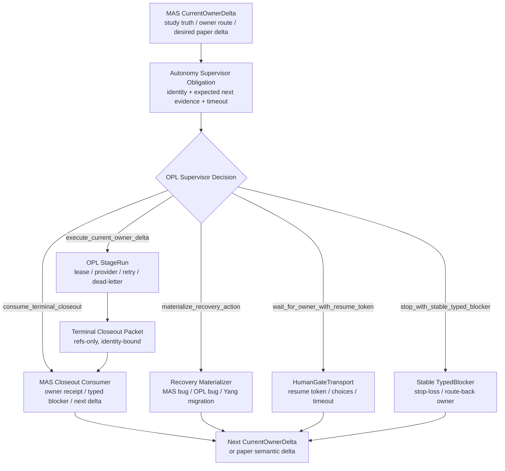

# MAS / OPL Paper Autonomy Supervisor 目标设计

Owner: `MedAutoScience / OPL Framework`
Purpose: `paper_autonomy_supervisor_target_design`
State: `active_target_design`
Machine boundary: 本文是人读目标设计和改造路线。机器真相继续归 `contracts/`、源码、CLI/MCP/API payload、OPL current-control / StageRun ledger、MAS runtime/controller durable surfaces、owner receipt、typed blocker、human gate、route-back evidence 和真实 workspace artifact。
Date: `2026-06-14`

## 目标判断

DM002 / DM003 暴露的顶层问题不是某个 reducer、DHD 白名单或 owner gate 缺口，而是 MAS / OPL 之间缺少一个一等的 paper progress transition 协议。`Paper Autonomy Supervisor` 在 MAS 侧只能作为 paper policy / projection adapter 入口；通用 durable runtime、obligation store、fixed-point reconcile、outbox、replay 和 human-gate resume token 都归 OPL `DomainProgressTransitionRuntime`。

理想态中，MAS 不负责长期在线调度，OPL 不负责医学判断。两者之间必须有一个可审计、可恢复、可超时、可分账的监督协议，把任何“自动论文推进没有继续”的状态稳定落到五类动作之一：

1. `execute_current_owner_delta`：同一 current identity 已满足 provider admission / StageRun 启动条件，交给 OPL 执行。
2. `consume_terminal_closeout`：同一 StageRun / work-unit 已 terminal，交给 MAS authority surface 消费 closeout。
3. `materialize_recovery_action`：问题属于 MAS / OPL 控制面或旧 study artifact 兼容迁移，生成正式 repair / migration work unit。
4. `wait_for_owner_with_resume_token`：确实需要人类或 owner 决策，必须有 OPL-owned durable human gate、候选分支、超时策略和 resume token；MAS 只消费同一 current identity 的 token/readback，不生成 token。
5. `stop_with_stable_typed_blocker`：当前 identity 已耗尽预算或缺不可补证据，产出 stable typed blocker / stop-loss，不再自动 redrive。

`operator_decision_required`、`human_gate`、`typed_blocker`、`provider_admission_pending_count=0` 和 `action_queue=[]` 都不能作为终点。它们必须被 supervisor obligation 继续解释成上述五类之一。

## 外部成熟模式

本设计只吸收成熟模式，不引入外部 runtime 或 authority。

| 来源 | 可取模式 | MAS / OPL 转译 |
| --- | --- | --- |
| Temporal Workflow message passing | Workflow 有状态地处理 Signals、Queries、Updates；读、写、读写请求分开；handler 基于当前 workflow state 运行。 | OPL 提供 query/update/signal 分层：query 只读监督事实，update 必须绑定 current identity，signal 用于 owner/human resume，不让 read-model 反向执行。 |
| AWS Step Functions callback task token | workflow 可携 task token 暂停，等待外部过程返回 token 和 payload 后继续。 | OPL `HumanGateTransport` 必须给每个 owner/human gate 一个 durable resume token；MAS 只消费 token 和 accepted answer shape，不生成 token，也不把聊天文字当恢复证据。 |
| Azure Scheduler-Agent-Supervisor | Scheduler 维护 durable state store，Agent 执行步骤，Supervisor 根据状态检测失败、重试或补偿。 | OPL 持有 scheduler / state store / supervisor；MAS 持有 domain authority。supervisor 只决定 transport / recovery action，不签医学 receipt。 |
| LangGraph interrupts / persistence | graph 可在节点中断，持久保存状态，等待外部输入后从中断点恢复。 | human gate 必须是持久中断点，而不是 heartbeat 文案；resume 后必须回到同一 work-unit identity。 |
| Durable workflow / idempotency / callback patterns | 重试和恢复必须有 caller intent、idempotency key、history / token，而不是靠同名 action。 | MAS / OPL 必须把 `route_identity_key`、`attempt_idempotency_key`、`owner_route_currentness_basis` 和 selected stage packet 作为 admission / closeout / redrive 的硬身份。 |

参考官方资料：

- Temporal Workflow message passing: <https://docs.temporal.io/encyclopedia/workflow-message-passing>
- AWS Step Functions service integration patterns / callback task token: <https://docs.aws.amazon.com/step-functions/latest/dg/connect-to-resource.html>
- Azure Scheduler Agent Supervisor pattern: <https://learn.microsoft.com/en-us/azure/architecture/patterns/scheduler-agent-supervisor>
- LangGraph interrupts: <https://docs.langchain.com/oss/python/langgraph/interrupts>

## 理想目标架构



核心原则：

- `current_owner_delta` 是唯一 desired root。OPL queue、attempt ledger、DHD、Portal、stage index 和 read-model 都只能解释它，不能反向发明下一步。
- `Autonomy Supervisor Obligation` 是 MAS / OPL 之间的新一等合同。它不是 read-model 文案；持久化、replay、fixed-point reconcile 和 read-model rebuild 归 OPL，MAS 只提供 paper policy input / accepted authority result。
- `operator_decision_required` 必须降级为 obligation 的一种 pending state，并带 `owner`、`allowed_decisions`、OPL-provided `resume_token`、`timeout_policy`、`default_safe_branch`、`current_identity` 和 `evidence_required`。
- old Yang artifacts 可以被修，但只能进入 `materialize_recovery_action`，并产出 `migration_receipt` / `compatibility_repair_receipt`。这类 receipt 只说明平台恢复，不计为论文语义进展。
- paper progress 单独记账。只有 MAS owner receipt、quality gate receipt、AI reviewer / gate delta、canonical paper / evidence / review / package semantic delta、human gate resume、route-back evidence 或 stable typed blocker 才算论文推进。

## 新核心合同

### `PaperAutonomyObligation`

每个 current owner delta 必须生成一个 obligation packet：

```json
{
  "surface_kind": "paper_autonomy_obligation",
  "study_id": "...",
  "quest_id": "...",
  "stage_id": "...",
  "action_type": "...",
  "work_unit_id": "...",
  "work_unit_fingerprint": "...",
  "route_identity_key": "...",
  "attempt_idempotency_key": "...",
  "desired_delta": {
    "owner": "MedAutoScience",
    "target_surface": "...",
    "required_output_ref_family": "owner_receipt_or_typed_blocker"
  },
  "expected_next_evidence": [
    "provider_admission_identity",
    "running_proof",
    "terminal_closeout",
    "owner_receipt",
    "typed_blocker",
    "human_gate_ref",
    "route_back_evidence_ref",
    "migration_receipt"
  ],
  "timeout_policy": {
    "heartbeat_budget": 2,
    "wall_clock_budget_seconds": 1800,
    "on_timeout": "materialize_recovery_action_or_stable_typed_blocker"
  }
}
```

### `SupervisorDecision`

supervisor 只能输出六类 decision：

- `execute_current_owner_delta`
- `consume_terminal_closeout`
- `materialize_recovery_action`
- `wait_for_owner_with_resume_token`
- `stop_with_stable_typed_blocker`

每个 decision 都必须有：

- `identity_match`
- `evidence_refs`
- `forbidden_interpretations`
- `next_owner`
- `next_safe_action`
- `paper_progress_classification`
- `platform_repair_classification`

### `RecoveryAction`

`materialize_recovery_action` 再细分为：

| Kind | Owner | 例子 | 输出 |
| --- | --- | --- | --- |
| `mas_control_plane_repair` | MAS repo | DHD currentness、owner gate projection、materializer selection | code/test/doc commit 或 stable typed blocker |
| `opl_runtime_repair` | OPL repo | execution authorization、StageRun lease、worker source stale | OPL receipt / deny blocker / human gate |
| `study_workspace_migration` | MAS owner callable | Yang 旧 artifact schema / stale currentness residue | append-only migration receipt，不写论文 truth |
| `operator_policy_materialization` | MAS / OPL | repeated operator decision timeout | human gate / route-back / stable blocker |

## OPL 基座优化

OPL 应把以下能力变成一等基座，而不是让 MAS/DHD/目标线程各自重算：

1. `StageRunIdentityPacket`
   - 包含 stage_run_id、route_identity_key、attempt_idempotency_key、selected stage packet、lease、provider attempt、workflow id、source fingerprint、truth/runtime epoch。
   - admission、running、terminal closeout、resume 和 redrive 都必须读同一 packet。

2. `HumanGateTransport`
   - OPL 持久化 callback token / resume token。
   - 每个 gate 有明确 choices、owner、timeout、default safe branch。
   - resume 后回到同一 current identity，不能靠聊天摘要或人工描述恢复；MAS 不合成 token，也不把缺失 token 的 wait state 写成已可 resume。

3. `RecoveryObligationStore`
   - 保存 desired/current/status 三元组。
   - 记录 no-progress budget、last evidence、stale read-model lag、supervisor decision。
   - query 只读，update 必须 identity-bound。

4. `SupervisorDecisionEngine`
   - 统一处理 heartbeat 后无进展、operator decision 超时、terminal closeout 未消费、stale running、weak admission identity、old artifact migration。
   - 输出六类 `SupervisorDecision`，不输出自由文本状态。

5. `StateIndexKernel`
   - 只存 refs、fingerprint、cursor、checksum、bounded preview hash、obligation id、decision id。
   - 不存 study truth、publication verdict、artifact body、memory body 或 paper body。

6. `Workbench Shell`
   - 默认只显示：当前 owner、是否真的 running、下一安全动作、是否等待 human token、是否平台修复、是否论文 semantic delta。
   - drilldown 才显示 DHD、queue、stage index、trace、lineage 和 telemetry。

7. `Observability Plane`
   - OpenTelemetry / lineage / trace span 只做 observability。
   - trace/span 不能关闭 owner receipt、quality gate、publication readiness 或 artifact authority。

## MAS 优化

MAS 侧应收敛为四个 authority / adapter 面：

1. `PaperProgressPolicyAdapter`
   - 从 study truth、publication eval、AI reviewer、controller decision、stage receipt 生成唯一 `current_owner_delta`。
   - 消费 OPL closeout，签 owner receipt / typed blocker / human gate / route-back。

2. `PaperRecoveryPolicyAdapter`
   - 接收 OPL supervisor 的 recovery decision。
   - 若是 MAS 控制面 bug，指向 repo 修复 lane。
   - 若是 Yang historical artifact 兼容问题，走 MAS owner callable / migration receipt。
   - 若是 OPL execution identity 问题，route 到 OPL owner，不让 MAS 自签 execution authorization。

3. `PaperProgressAccountingAdapter`
   - 强制分账：`paper_semantic_delta`、`platform_repair_delta`、`observability_delta`、`migration_delta`。
   - 默认用户汇报先说论文 delta；没有论文 delta 时明确说这是平台恢复。

4. `PaperAuthorityResultShapes`
   - 所有 owner callable / controller / materializer 输出统一包成 envelope：
     - `owner_receipt_ref`
     - `typed_blocker_ref`
     - `human_gate_ref`
     - `route_back_evidence_ref`
     - `paper_delta_refs`
     - `platform_repair_refs`
     - `no_forbidden_write_proof`

## 运行流程

1. MAS 生成 `current_owner_delta`。
2. MAS 同步生成 `PaperAutonomyObligation`。
3. OPL Reconciler 读取 obligation 和 current StageRun / queue / closeout / human gate state。
4. OPL 输出一个 `SupervisorDecision`。
5. 若 decision 是 execute，OPL 启动或恢复 StageRun。
6. 若 decision 是 consume closeout，MAS consume closeout 后生成 next owner delta 或 receipt/blocker。
7. 若 decision 是 recovery action，进入 MAS repo / OPL repo / Yang migration lane，并产出 recovery receipt。
8. 若 decision 是 human gate，OPL 保存 token，MAS 保存 domain question 和 accepted answer shapes。
9. 若 decision 是 stable blocker，MAS / OPL 共同投影 next owner 和 stop-loss reason。

任何一步都不得把 query/read-model 输出当 command，不得把 transport success 当 paper progress。

## 迁移路线

### Lane 0：合同和文档入口

- 新增 `contracts/paper_autonomy_supervisor_contract.json`。
- 在 `docs/runtime/designs/stage_route_reconcile_target.md` 中把 stage-route arbiter 下沉为 supervisor 的一个 decision source。
- 在 `docs/active/mas-ideal-state-gap-plan.md` 增加 Paper Autonomy Supervisor lane。

完成门：meta test 能证明 five-decision taxonomy、identity fields、paper/platform 分账、read-model forbidden authority 都存在；该门只关闭合同入口，不关闭 runtime tail。

### Lane 1：OPL 基座

- OPL 新增 `RecoveryObligationStore` 和 `SupervisorDecisionEngine`。
- StageRun identity packet 原样嵌入 MAS provider admission identity。
- HumanGateTransport 支持 durable resume token、timeout、default safe branch；该 token 由 OPL 持久化，MAS 只消费同一 current identity 的 token readback。

完成门：OPL readback 能对同一 obligation 给出 execute / wait / stop / owner-receipt stop / recovery / consume 六类 decision fixture。

### Lane 2：MAS policy / projection adapter

- MAS DHD / study_progress / domain-handler export 只消费 `SupervisorDecision`，不再各自从 queue / DHD / stage index 重算 currentness。
- owner gate route-back event 被 materialize 成具体 recovery action 或 typed blocker，不停留在人读 human_gate。
- OPL execution authorization 缺口统一转为 OPL-owned `wait_for_owner_with_resume_token` 或 `stop_with_stable_typed_blocker`。

完成门：DM002 / DM003 类 fixture 不再出现 `operator_decision_required` 长停；`paper_recovery_state` 必须内嵌同一 identity 的 `supervisor_decision`，且 DHD / study_progress / domain-handler / operator projection 只能消费该 decision，不能从 queue、provider count、stage index 或 docs text 重算 currentness。DM002 / DM003 live-shape canary 必须证明 `provider_admission_pending_count=0` 与 `action_queue=[]` 只进入 `forbidden_interpretations`，并且每篇 exactly one supervisor decision 映射到 recovery action、human token、stable blocker、admission/running 或 owner delta。

### Lane 3：Yang workspace migration lane

- 增加 `study_workspace_migration` owner action。
- 只修旧 schema、旧 currentness residue、旧 artifact layout、缺失 stage packet binding 的历史兼容面。
- migration 输出 append-only receipt 和 before/after fresh readback。

完成门：migration receipt 不计 paper progress，但能解除由旧 artifact 导致的新 MAS 阻塞。

### Lane 4：operator / workbench

- 默认视图从“状态解释”改成“当前六类 decision + next owner”。
- 对每篇论文显示：
  - `paper_delta`
  - `platform_repair_delta`
  - `migration_delta`
  - `running_proof`
  - `human_gate_token`
  - `stable_blocker`

完成门：operator 不需要读 DHD、queue 和 stage index 才能知道下一步归谁。

### Lane 5：真实 paper-line soak

- 以 DM002 / DM003 为 canary。
- 每轮 supervisor tick 必须产生六类 decision 之一。
- 连续 heartbeat 无论文 delta 时，必须自动升级到 recovery action、human token 或 stable blocker。

完成门：至少一次真实论文链路从 current owner delta 进入 running / terminal / consume closeout / next owner delta，并保留 paper/platform 分账；同时必须有 fresh `supervisor_decision` readout、derived surfaces consume-only 证明、OPL substrate 对同 obligation 的 readback，以及 DM002/DM003 live-shape canary 持续通过。

## 不做的事

- 不把 MAS 重新做成私有 scheduler / queue / worker residency owner。
- 不把 OPL queue / attempt / trace / read-model 写成医学 truth。
- 不让 `operator_decision_required`、`human_gate` 或 `typed_blocker` 长期停留为不可消费状态。
- 不把 Yang migration 写成论文进展。
- 不把外部 agent framework、LangGraph、Temporal、Step Functions 或 Azure pattern 作为新 runtime 依赖引入 MAS。
- 不让 sidecar advisory、ranking、tool selector、memory hint 阻断 ordinary current owner action。

## 验收标准

理想态验收不是“测试绿”或“状态看起来合理”，而是以下行为稳定成立：

1. 每个 current owner delta 都有一个 obligation id。
2. 每次监督 tick 都输出六类 decision 之一。
3. 每个可恢复 wait state 都有 OPL-provided resume token、timeout 和 default safe branch；MAS 缺 token 时只能投影等待，不能合成 token。
4. 每个 recovery action 都明确 owner：MAS repo、OPL repo、Yang migration 或 human owner。
5. 每个 reported progress 都分账为 paper semantic / platform repair / migration / observability。
6. 同一 identity 重复 no-progress 到预算后，系统自动 stop-loss 或 route-back，不重复 redrive。
7. operator 默认读面不需要倒查 DHD/queue/stage index 就能判断下一步。
8. OPL substrate 可以处理 durable execution 和 human-gate transport，MAS policy adapter 可以消费结果并生成 owner receipt / typed blocker / next delta。
9. `provider_admission_pending_count=0`、`action_queue=[]`、`observe_only` 和 `queue_empty` 只允许作为 `forbidden_interpretations` 或诊断证据，不能作为 terminal/idle supervisor decision。
10. 完整完成声明必须同时具备 fresh `supervisor_decision` readout、derived surfaces consume-only、OPL substrate readback、DM002/DM003 live-shape canary 和真实 paper-line tick evidence；contract landed、docs updated、tests green 或 read-model projection landed 都不能替代这些门。
