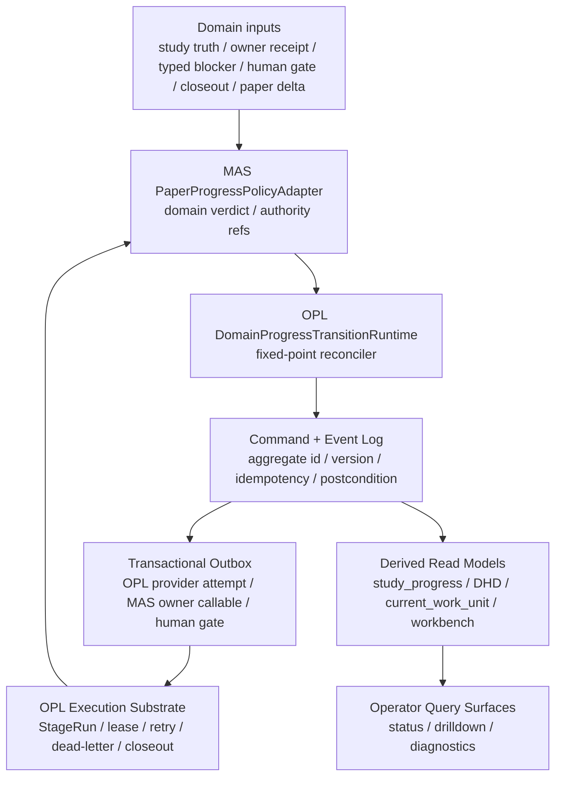

# OPL Domain Progress Transition Runtime 与 MAS Paper Policy Adapter 目标设计

Owner: `MedAutoScience / OPL Framework`
Purpose: `opl_domain_progress_transition_runtime_target_design_for_mas`
State: `active_target_design`
Machine boundary: 本文是人读目标设计和落地路线。机器真相继续归 `contracts/`、源码、CLI/MCP/API payload、OPL current-control / StageRun ledger、MAS runtime/controller durable surfaces、owner receipt、typed blocker、human gate、route-back evidence、fresh `study_progress` / DHD readback 和真实 workspace artifact。
Date: `2026-06-16`

## 2026-06-16 落地状态

当前已完成 first slice 的方向纠偏：OPL `one-person-lab` 已落地 `DomainProgressTransitionRuntime` 最小切片，覆盖 command normalization、transition event、transactional outbox item、projection metadata、StageRun identity、idempotency、`NonAdvancingApply` 和 replay/readback 测试。该能力落在 OPL 既有 Runway / Pack / Stagecraft / Console / Vault 分工内，没有新增第 11 品牌模块，也没有为旧监督 apply 入口保留兼容字段。

MAS 侧已删除私有 `paper_progress_transition_kernel` 方向，保留 `PaperProgressPolicyAdapter`。DHD provider-admission 候选现在只携带 MAS `paper_progress_policy_result` 和 `opl_domain_progress_transition_request`；MAS 明确 `mas_can_authorize_provider_admission=false`、`mas_can_run_fixed_point_reconciler=false`、`mas_can_own_event_log_or_outbox=false`、`mas_can_create_opl_outbox_record=false`，并把 transition runtime owner 指向 OPL。`opl_domain_progress_transition_request` 只能表达 MAS domain policy request，不携带 `projection_metadata`、StageRun identity、OPL event、OPL outbox、read-model generation metadata 或旧 current-control command；MAS projection metadata 只能留在 `paper_progress_policy_result`、candidate/read-model projection 和 study progress 派生面。OPL intake 负责把 clean request normalize 成 OPL-owned command / event / transactional outbox / StageRun readback。root `action_queue`、study `current_executable_owner_action` 和 `current_work_unit` 三类候选入口都必须消费同一 adapter / request shape，不能把 outbox record 作为 MAS 生成的新 authority。

DHD `obligation_actuator` 现在只作为 MAS policy / owner-answer readback 和 fail-closed typed blocker 投影：它可以识别 MAS owner callable receipt、MAS typed blocker、human/route-back diagnostic 和 OPL readback，但不能自签 provider admission。`provider_admission_pending` 在 MAS 侧必须有 OPL `opl_domain_progress_transition_runtime_live_readback` 完整 shape 支撑：`identity`、`causality`、`authority_boundary`、`exactly_one_outcome`、`projection_metadata` 与同一 transition 的 event/outbox/StageRun live readback 缺一不可；只有 MAS transition request、OPL command/event/outbox log、或只有旧式 `event_id` / `outbox_item_id` / `stage_run_id` projection 时，DHD 必须写 `NonAdvancingApply` typed blocker。旧 `paper_autonomy_supervisor_apply` 不保留 alias；旧 `current_control_command`、ready dispatch、queue item 或 read-model carrier 不能作为入站 alias。provider admission arbiter、`paper_recovery_state`、`current_work_unit`、`current_executable_owner_action` 和 study_progress refresh 在迁移完成前只能是 projection / migration adapter；当前 MAS refresh 只允许 single-pass projection normalization，fixed-point runtime owner 是 OPL。它们必须逐步消费 OPL transition event + MAS policy result，不能重新持有 event log、outbox、StageRun lifecycle、fixed-point 或 provider admission authority。

2026-06-16 tail slice 进一步把 owner callable / worker handoff 执行面收回同一边界：`domain-handler export`、paper recovery successor dispatch、AI reviewer record handoff、quality writer handoff、`paper_repair_executor` 和 default executor dispatch 可以生成 `opl_domain_progress_transition_request` 及 refs-only handoff evidence，但只要缺 OPL `DomainProgressTransitionRuntime` 完整 readback shape，或缺 OPL provider attempt / lease / closeout receipt binding，就不能被 MAS 计为 provider admission、provider attempt lease 或 `handoff_ready` execution。`domain-owner-action-dispatch` 现在在 action executor 返回后统一检查 transition request；缺带 `identity` / `causality` / `authority_boundary` / `exactly_one_outcome` / `projection_metadata` 的 OPL live readback 时保留 handoff refs 供 OPL 接管，同时把 execution fail-closed 为 `opl_execution_authorization_required` typed blocker，`executed_count=0`、`codex_dispatch_count=0`、`mas_creates_opl_outbox=false`。`paper_repair_executor` 同样只把 ready worker handoff 读作 OPL-authorized owner callable handoff；无 proof 的 `dispatch_status=ready` carrier 必须降级为 `opl_execution_authorization_required`，不得靠 MAS-local `ok=true` 或 handoff payload 自行升级。它不是兼容 alias，也不是 MAS 私有 attempt lifecycle；它只是 MAS policy adapter 到 OPL runtime 的 admission boundary。

当前 MAS replay fixture 已从 first slice 扩到 DM002 / DM003 代表性历史坏轨迹：`tests/test_paper_progress_transition_replay_fixtures.py` 现在覆盖 DM002 stable typed blocker、DM003 owner-action request 缺 OPL readback、owner receipt recorded 后同 identity 不推进、same-tick stale blocker / admission 冲突、`provider_admission_pending_count=0` 禁止解释、`current_work_unit` 与 `paper_recovery_state` 分歧、DHD/request 无 OPL readback 进入 `NonAdvancingApply`，以及 human gate / route-back accepted shape。`contracts/paper_progress_replay_live_evidence_status.json` 同步记录 replay coverage 与只读 live-evidence acceptance boundary：fresh live acceptance 只能是 strict current-identity running proof、owner receipt、stable typed blocker、human gate、route-back evidence 或 paper/gate/artifact semantic delta 中 exactly-one。它仍不是 live paper progress claim。完成门继续要求 OPL outbox / StageRun identity live readback、DHD apply exactly-one live outcome、provider admission arbiter 完全消费 OPL transition event，以及 DM002 / DM003 fresh live paper-line outcome。docs、contract、focused tests、projection clean、queue empty、`provider_admission_pending_count=0` 或 DHD dry-run 仍不能替代 running proof、owner receipt、stable typed blocker、human gate、route-back evidence 或 paper-gate-artifact semantic delta。

2026-06-17 MAS adapter 消费面补齐：`PaperProgressPolicyAdapter` 现在显式覆盖 owner receipt、typed blocker、publication gate / paper delta、forbidden write、human gate / route-back 和 `NonAdvancingApply` 结果形状，并把 clean `opl_domain_progress_transition_request` 保持为 MAS domain policy request；request 不携带 OPL runtime artifact 字段，authority boundary 继续声明 MAS 不能 authorize provider admission、event log、outbox、StageRun 或 fixed-point runtime。该状态由 `tests/test_paper_progress_policy_adapter.py` 与 replay fixture focused tests 证明；它仍不是 live DHD apply 前进、provider running proof 或 paper-line completion claim。

## 目标判断

DM002 / DM003 最近一个月反复暴露的 currentness、owner-route、owner receipt、provider admission 和 supervision 修复，不是因为 MAS 缺少又一个私有控制模块，而是因为 OPL 尚未把“domain agent 的 current owner delta 如何事务化前进”做成一等通用基座。论文推进状态机因此被拆散在多个 projection / selector / arbiter / actuator 中：`current_work_unit`、`paper_recovery_state`、`current_executable_owner_action`、DHD provider admission、OPL current-control、Paper Autonomy Supervisor 和 read-model projection 都可能重新解释同一个 owner receipt、typed blocker、closeout 或 queue residue。

长期目标必须收敛为：

`OPL DomainProgressTransitionRuntime + MAS PaperProgressPolicyAdapter -> durable command/event log + transactional outbox -> derived projections`

`DomainProgressTransitionRuntime` 是 OPL-owned 通用能力，负责 durable command/event log、fixed-point reconciler、transactional outbox、StageRun identity、idempotency、projection metadata、replay harness、`NonAdvancingApply` 和 human gate resume。`PaperProgressPolicyAdapter` 是 MAS-owned domain policy，负责 owner receipt / typed blocker / publication gate / artifact delta / forbidden write / reviewer-human gate 的医学语义裁决。

MAS 不应长期持有一个横跨 OPL Runway / Console / Vault / Pack / Stagecraft 的私有 `PaperProgressTransitionKernel`。MAS 只提供 policy adapter、authority functions 和 domain contract；OPL 提供通用 transition runtime。所有 read model、DHD、study progress、domain-handler export、operator card、OPL admission 和 workbench 只能消费 OPL runtime 事件与 MAS policy 结果；不能再从 queue、stage artifact index、旧 dispatch、provider count、operator 文案、trace/span 或 read-model refresh 反向生成下一步。

## 为什么旧修复会复发

1. 旧修复多在派生面之间加优先级、currentness guard、stale residue filter 或 special case，修的是“哪个 surface 赢”，不是“谁唯一有权推进状态”。
2. supervision 已有价值，但当前形态仍偏 readback / guard / decision source，没有成为唯一 transition owner；因此下游 DHD / provider admission / current-work-unit 仍可能旁路生成动作。
3. apply 语义仍像单次 materialization，而不是 fixed-point reconcile。apply 后如果回到同一 `owner_receipt_recorded`、旧 blocker 或无 outcome 状态，系统应写出 `non_advancing_apply` typed blocker，而不是返回看似成功的 projection refresh。
4. 测试过多锁定局部 reducer case，缺少跨 MAS / OPL / DHD / readback 的历史坏轨迹 replay fixture。局部绿不能证明 live apply 已产生 exactly-one outcome。

## 外部成熟模式映射

本文只吸收成熟工程模式，不引入外部 runtime 或 authority。

| 来源 | 可取模式 | MAS / OPL 转译 |
| --- | --- | --- |
| Kubernetes controller | controller 持续观察 desired/current state，并把 current 推向 desired；status 是观测，不是 desired。 | OPL transition runtime 持 desired/current/status 控制环；MAS 只给 desired domain policy 和 authority verdict。 |
| Kubebuilder / controller-runtime | Reconcile 必须幂等，按事件类型写一次性分支容易让资源卡住。 | OPL reconciler 必须可重复执行；MAS policy adapter 在同一 identity 下给出同一 accepted transition、blocker、human gate 或 domain verdict。 |
| Temporal durable execution | workflow history 支撑 replay、resume、activity retry；completion 不等于 domain acceptance。 | OPL 保存 StageRun / attempt / closeout event history；MAS consume closeout 后才签 owner receipt、typed blocker 或 next owner delta。 |
| CQRS / Event Sourcing | command / event / projection 分离；read model 是派生视图，可滞后、可重建。 | OPL 持通用 outbox/event log 与 projection rebuild；MAS event payload 只表达 domain authority result 和 policy refs。 |
| Transactional Outbox | 状态变化与外发事件在同一事务边界内持久化，避免半成功。 | OPL runtime 在同一事务边界提交 transition event 与 outbox；MAS owner callable / provider start / human gate 是 outbox side effect。 |

参考：

- Kubernetes Controllers: <https://kubernetes.io/docs/concepts/architecture/controller/>
- Kubebuilder good practices: <https://book.kubebuilder.io/reference/good-practices.html>
- Temporal Event History: <https://docs.temporal.io/workflow-execution/event>
- Azure CQRS pattern: <https://learn.microsoft.com/en-us/azure/architecture/patterns/cqrs>
- Azure Event Sourcing pattern: <https://learn.microsoft.com/en-us/azure/architecture/patterns/event-sourcing>
- Azure Transactional Outbox pattern: <https://learn.microsoft.com/en-us/azure/architecture/databases/guide/transactional-out-box-cosmos>

## 目标架构



原则：

- `DomainProgressTransitionRuntime` 是 OPL-owned 通用 transition authority for execution state。Paper Autonomy Supervisor 的通用 obligation / fixed-point / replay / projection 能力必须上收到 OPL runtime；MAS 只保留 paper-specific policy adapter 和 authority functions。
- `commands` 表示意图，`events` 表示已提交事实，`projections` 只是派生读面。DHD apply、owner-route reconcile 和 provider admission 只能提交 OPL command 或消费 OPL event，再由 MAS policy adapter 裁决 domain result；不能直接写出平行 truth。
- 每个 transition 必须绑定 `aggregate_id = study_id + work_unit_id + work_unit_fingerprint`，并携带 `source_generation`、`expected_version`、`idempotency_key`、`causal_event_id`、precondition 和 postcondition。
- 所有 projection 必须携带 `derived_from_event_id`、`observed_generation`、`lag_status` 和 `authority=false`。缺这些字段时只能作为 diagnostic。
- 同一 apply / reconcile loop 每轮只能提交 exactly-one transition；若没有 transition 成立，必须提交 stable typed blocker、human gate、route-back evidence 或 `non_advancing_apply`。

## Transition 类型

OPL runtime 输出只能来自固定 transition 枚举；MAS policy adapter 决定哪些 transition 在医学论文语义上可接受、应转 owner receipt / typed blocker / human gate，或应 fail closed：

| Transition | 语义 | 稳定 outcome |
| --- | --- | --- |
| `ConsumeOwnerReceipt` | 消费同 identity owner receipt，生成下一 owner delta 或 terminal state。 | `owner_receipt_consumed` / `next_current_owner_delta` |
| `StartProviderAttempt` | 对同 identity current owner action 发起 OPL StageRun / provider attempt。 | `provider_admission_accepted` / `running_proof` |
| `ConsumeTerminalCloseout` | 消费 OPL terminal closeout，进入 MAS authority 判定。 | `owner_receipt_ref` / `typed_blocker_ref` / `route_back_evidence_ref` |
| `RecordTypedBlocker` | 写出 stable blocker，命名 owner、缺口、currentness refs 和可恢复条件。 | `typed_blocker_ref` |
| `OpenHumanGate` | 打开必须由人类或真实 owner 决策的 gate，并给 resume token。 | `human_gate_ref` |
| `MaterializeOwnerAction` | 物化 MAS owner callable / recovery action 的合法请求。 | `owner_action_ref` / `owner_callable_request_ref` |
| `AdoptPaperDelta` | 接受 canonical paper / artifact / evidence / review / gate semantic delta。 | `paper_delta_refs` / `quality_gate_receipt_ref` |
| `AdoptRouteBackEvidence` | 接受 route-back / successor owner evidence。 | `route_back_evidence_ref` / `next_current_owner_delta` |
| `StopLoss` | 对同 identity 达到预算边界，停止自动 redrive。 | `stable_stop_loss_typed_blocker_ref` |
| `NonAdvancingApply` | apply 后 fresh readback 未前进，禁止 ok=true。 | `non_advancing_apply_typed_blocker_ref` |

`provider_admission_pending_count=0`、`action_queue=[]`、docs updated、tests passed、read-model refreshed、recorded-only receipt 和 refs-only ledger 都不是 transition outcome。

## Fixed-point Controller

每次 DHD apply、supervisor tick 或 owner-route reconcile 必须走同一 fixed-point loop：

```text
read authoritative event state
read external observations with source generation
decide exactly one transition
commit outbox/event with compare-and-set
emit transactional outbox item if side effect is needed
apply side effect through OPL or MAS owner callable
fresh readback
repeat until stable outcome
```

稳定 outcome 只允许：

- strict current-identity running proof
- provider admission accepted
- owner receipt consumed into next owner action
- owner receipt / quality gate receipt
- stable typed blocker
- human gate with resume token
- route-back evidence
- canonical paper / gate / artifact / review semantic delta
- terminal stop-loss

如果 loop 在同一 aggregate/version 上重复看到相同状态，OPL runtime 必须提交 `NonAdvancingApply` execution event；MAS policy adapter 再把它解释为 MAS control-plane blocker、OPL substrate blocker、study workspace migration blocker 或 human gate。

## MAS / OPL 分工

| 层 | OPL owner | MAS owner |
| --- | --- | --- |
| Durable execution | StageRun、lease、queue、retry/dead-letter、workflow history、attempt ledger、heartbeat、worker lifecycle。 | 不持有 generic execution lifecycle。 |
| Command processing | Idempotent command runner、transactional outbox、generic event append、read-model rebuild、fixed-point reconciler。 | 定义 domain command semantics、precondition、postcondition 和 forbidden authority。 |
| Domain authority | 不判断 paper quality、publication ready、artifact mutation、owner receipt 语义。 | study truth、source readiness、AI reviewer / gate verdict、artifact/package authority、owner receipt、typed blocker、human gate、route-back。 |
| Read models | 投影 OPL runtime status、attempt health、transport refs、workbench drilldown。 | 投影 MAS domain status、current owner delta、paper progress ledger、authority refs。 |
| Recovery | OPL runtime repair、stale worker、attempt identity、human gate transport。 | MAS control-plane repair、paper recovery semantics、Yang workspace migration receipt、medical typed blocker。 |

OPL 不解释 MAS paper recovery、publication quality 或 artifact authority；MAS 不私有实现 generic scheduler、attempt lifecycle、event log、outbox、projection rebuild 或 fixed-point runtime。双方通过 MAS `opl_domain_progress_transition_request` 与 OPL-owned command / event / transactional outbox runtime result 连接。

## 现有 surface 的目标读法

| Surface | 目标角色 | 禁止行为 |
| --- | --- | --- |
| `paper_autonomy_supervisor` | 短期作为 MAS-side policy / obligation adapter；长期通用 obligation runtime 上收到 OPL。 | 作为 MAS 私有平行控制面。 |
| `paper_recovery_state` | OPL transition event + MAS policy result 派生的 recovery projection。 | 从旧 dispatch / queue residue 重新选 next action。 |
| `current_work_unit` | 当前 aggregate 的 projection。 | 覆盖 kernel transition 或发明 provider admission。 |
| `current_executable_owner_action` | operator/executor read model。 | 把 stage index / DHD preview 当 authority。 |
| DHD dry-run | diagnostic query。 | 声明恢复或 paper progress。 |
| DHD apply | OPL fixed-point controller 的 consumer/readback 入口；MAS 只提供 policy adapter 和 owner-answer/fail-closed projection。 | 在 MAS 内自建 fixed-point loop，或单次 materialize 后没有 postcondition 仍 ok=true。 |
| OPL current-control | generic execution state。 | 签 MAS owner receipt 或解释 publication readiness。 |
| Stage artifact index | rebuildable diagnostic / fallback projection。 | 在 current owner surface 存在时反向覆盖 currentness。 |
| Workbench / Portal | query / drilldown / operator UX。 | 以 UI visible、queue empty 或 active_run_id 声明 progress。 |

## 迁移路线

### Lane 0：合同和文档入口

- 固定本文、active plan 和 runtime README 入口。
- 在 OPL 侧新增或更新通用 `DomainProgressTransitionRuntime` contract：transition enum、aggregate identity、event envelope、projection metadata、fixed-point postcondition、forbidden interpretations。
- 在 MAS 侧新增或更新 `PaperProgressPolicyAdapter` contract：owner receipt / typed blocker / human gate / paper delta / forbidden write / publication gate 的 accepted shapes。
- 将 `paper_autonomy_supervisor_contract` 标记为临时 MAS adapter 和未来 OPL transition runtime consumer，而不是长期 MAS 私有控制面。

完成门：contract / meta tests 能证明 transition taxonomy、identity、projection `authority=false`、fixed-point postcondition 和 forbidden interpretations 存在。此门不声明 live progress。

### Lane 1：Replay fixtures

- 把最近 DM002 / DM003 坏轨迹转成 event trace replay：owner receipt recorded 后不推进、same-tick admission 被 stale blocker 压掉、provider admission pending 为 0、current_work_unit 与 paper_recovery_state 分歧、DHD/request 无 OPL readback 后无 outcome、人类 gate / route-back accepted shape。
- 旧局部 reducer fixtures 继续保留，但不能替代 replay acceptance。

当前状态：`tests/test_paper_progress_transition_replay_fixtures.py` 已覆盖上述代表性 replay trace，`contracts/paper_progress_replay_live_evidence_status.json` 记录 replay coverage 和 forbidden completion interpretations。

完成门：每条历史 trace 都收敛到 exactly-one transition 或 `NonAdvancingApply` typed blocker；该门只证明 replay/contract acceptance，不声明 live paper progress。

### Lane 2：OPL runtime first slice

- 先覆盖 `owner_receipt_recorded`、`typed_blocker`、`provider_admission`、`terminal_closeout`、`paper_recovery_successor` 这五类 DM002 / DM003 高频路径。
- DHD apply 改为调用 OPL fixed-point controller，并通过 MAS policy adapter 裁决 domain result。
- `paper_recovery_state`、`current_work_unit`、`current_executable_owner_action` 改为从 OPL transition event + MAS policy result 派生。

完成门：focused tests + DHD apply readback 证明同一 aggregate 每轮 exactly-one outcome；无 outcome 时写 `NonAdvancingApply`。

### Lane 3：OPL substrate hardening

- OPL 提供 `StageRunIdentityPacket`、durable command/outbox consumer、human gate resume token、attempt event history、read-model rebuild metadata。
- Provider admission 只接受 OPL transition outbox item，不再从 MAS read-model residue 入队。

完成门：OPL readback 对同一 outbox item 给出 accepted / running / terminal / blocked / stale-owner-denied，并保留 idempotency。

### Lane 4：Projection demotion and retirement

- 所有 read model 增加 `derived_from_event_id`、`observed_generation`、`authority=false`。
- 删除或退役仍能直接写 next action 的旧 selector / materializer / alias。
- Workbench 默认显示 kernel state；DHD / queue / stage index 进入 drilldown。

完成门：grep / tests / contract inventory 证明 projection surface 不再有 transition authority；旧入口只保留 tombstone/provenance 或 diagnostic。

### Lane 5：Live paper-line acceptance

- 对 DM002 / DM003 执行 fresh kernel-driven apply。
- 成功不以测试绿或 projection clean 为准，只以 stable outcome 为准。

只读验收口径：fresh live acceptance 只能来自 fresh `study_progress`、DHD dry-run 或受委托 apply/readback、OPL current-control / StageRun readback 与 MAS owner evidence 的同 identity 交叉验证；`contracts/paper_progress_replay_live_evidence_status.json#/live_evidence_acceptance` 记录 allowed exactly-one family。

完成门：每篇 paper 出现 strict current-identity running proof、owner receipt、stable typed blocker、human gate、route-back evidence 或 paper/gate/artifact semantic delta 中 exactly-one outcome。

## 验证策略

按风险分层：

- L1 docs / contract planning：`git diff --check`、conflict marker scan、docs index path check。
- L3 contract / behavior：kernel contract schema tests、projection metadata tests、forbidden interpretation tests、replay fixture tests。
- L4 runtime currentness：fresh `study_progress`、DHD apply/readback、OPL current-control readback、owner receipt / typed blocker / human gate / route-back artifact refs。

禁止完成声明：

- `contract_landed` 不能代表 kernel landed。
- focused tests 通过不能代表 live DHD apply 前进。
- provider completion 不能代表 MAS owner acceptance。
- OPL queue empty、provider admission pending 0、read-model refreshed、docs updated 不能代表 paper progress。
- side conversation、supervisor report 或 workbench visible 不能替代 owner receipt / typed blocker / running proof。

## 与现有文档的关系

- [Paper Autonomy Supervisor 目标设计](./paper_autonomy_supervisor_target.md) 继续定义 obligation 和六类 supervisor decision；本文把其中通用 obligation / reconcile / replay 能力上收到 OPL transition runtime，把 MAS 部分收薄为 paper-specific policy adapter。
- [PaperRecovery Obligation 目标架构](./paper_recovery_obligation_target_architecture.md) 继续定义 recovery obligation 的输入/输出和派生面规则；本文要求 recovery obligation 长期由 OPL runtime 承载，MAS 只解释 paper recovery domain policy。
- [MAS / OPL Agent OS 目标运行架构](./mas_opl_agent_os_target_operating_architecture.md) 继续定义 OPL Agent OS / MAS Medical Research Pack / Authority Kernel 总体分层；本文是 OPL domain progress runtime 在 MAS paper-line 上的目标消费设计。
- [MAS 理想目标态差距与完善计划](../../active/mas-ideal-state-gap-plan.md) 维护当前执行顺序、状态、完成门和 open evidence tail。
