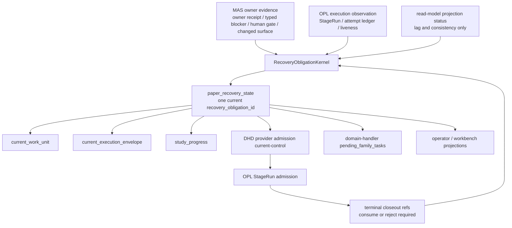

# PaperRecovery Obligation 目标架构

Owner: `MedAutoScience / OPL Framework`
Purpose: `paper_recovery_obligation_target_architecture`
State: `active_target_design`
Machine boundary: 本文是人读目标架构与迁移说明。机器真相归 `contracts/paper_recovery_kernel_contract.json`、`contracts/stage_route_reconcile_contract.json`、源码、测试、fresh `study_progress`、DHD dry-run / apply、OPL current-control / attempt ledger、owner receipt、typed blocker、human gate、route-back evidence 和 canonical changed surface refs。

## 结论

DM002 / DM003 暴露的反复卡点不是单个 reducer 分支漏判，而是多个 projection / selector / export 面各自重新解释 currentness。目标态必须把恢复链收成一个深模块接口：

`RecoveryObligationKernel input evidence -> paper_recovery_state -> derived projections`

`current_work_unit`、`current_execution_envelope`、`study_progress`、DHD provider admission、domain-handler export、operator card 和 OPL admission 都只能消费 `paper_recovery_state` 的 `phase`、`conditions`、`next_safe_action`、identity 和 closeout refs；它们不能从 queue、旧 dispatch、transport status、operator card、trace/span 或 read-model refresh 反向生成恢复真相。

## 目标调用图

`paper_recovery_state` 是唯一 decision root。OPL 的 StageRun / queue / attempt ledger / worker lifecycle 是 current execution substrate；MAS 的 PaperRecovery / owner receipt / typed blocker / quality gate / human gate 是 domain authority。

## 接口

输入族：

- `mas_owner_evidence`：current owner delta、owner receipt、quality gate receipt、stable typed blocker、human gate、route-back evidence、canonical changed surface refs。
- `opl_execution_observation`：StageRun lease、attempt ledger、Temporal/provider liveness、worker/source readout。
- `terminal_closeout_refs`：同 identity terminal closeout、accepted/rejected refs、stage log accounting refs。
- `manual_or_human_gate_refs`：manual foreground adoption refs、human/operator decision refs。
- `read_model_projection_status`：projection consistency、stale/lag evidence、diagnostic refs。

输出固定为 `paper_recovery_state`，phase 只能是合同允许的互斥枚举：`owner_action_ready`、`admission_pending`、`admission_blocked`、`attempt_running`、`terminal_closeout_ready`、`owner_answer_consumed`、`domain_blocked`、`human_gate`、`projection_inconsistent`、`manual_foreground_unadopted`。

## 派生面规则

派生面必须满足 `consume_only_no_redecide_currentness`：

- 读取 `recovery_obligation_id`、`phase`、`conditions`、`next_safe_action`、`current_work_unit_identity`、`provider_admission_identity`、`terminal_closeout_refs` 和 `consumed_or_rejected_refs`。
- 缺任一关键输入时进入 `projection_inconsistent` 或 `admission_blocked`，不得补造 provider admission。
- `domain_handler_export.pending_family_tasks` 只能来自 kernel 输出的合法 provider admission identity，不能从旧 persisted dispatch 或 queue residue 反推。
- `current_work_unit` / `current_execution_envelope` 只负责展示当前义务，不重新选择 recovery obligation。

## OPL 基座边界

OPL 已经应承担并持续强化以下 substrate：

- selected stage packet currentness identity：`dispatch_ref`、`stage_packet_ref`、`selected_dispatch_ref`、`stage_packet_refs`。
- StageRun attempt idempotency：`route_identity_key` 和 `attempt_idempotency_key` 原样进入 StageRun。
- terminal closeout transport precedence：terminal/accepted closeout 只作为 execution evidence，等待 MAS consume/reject。
- worker source stale restart guard：只在 Temporal reachable、attempt ledger readable、无 active attempt 时允许 supervisor repair。

MAS 不继续在私有 runtime 中裁判 StageRun currentness、queue residue、terminal precedence 或 worker restart。MAS 只负责 emit 完整 provider admission identity、拒绝弱 identity、消费 terminal closeout 为 owner receipt / typed blocker / next owner，且永不签 OPL runtime lifecycle claim。

## 外部经验映射

- Kubernetes controller：desired/current/status 分离；`current_owner_delta` 是 desired root，OPL StageRun 是 current，conditions/status 不能生成 desired。
- Temporal：event history 和 activity retry 是 durable execution evidence；provider completion 不等于 MAS domain acceptance。
- AWS idempotent APIs：caller intent 必须由显式 idempotency key 表达；同 action label 不构成同一请求。
- Azure CQRS：read model 可滞后，但要显式投影 evidence status；read-model refresh 不能作为 domain progress。
- Google SRE retry budget：同一 identity 无进展 redrive 必须有预算，耗尽后转 successor obligation / human gate / stable typed blocker。

## 迁移顺序

1. 引入纯 decision object / fixture：用 DM002 `stage_packet_not_current_selected_dispatch` 和 DM003 pending admission / projection inconsistent 作为 golden negative fixtures，不触碰 live recovery。
2. 让 `current_work_unit` 与 DHD provider admission 消费同一个 kernel 输出；删除重复 currentness precedence。
3. 让 `domain-handler export` 只消费 kernel admission output，旧 dispatch / queue residue 只能进入 diagnostic。
4. 让 operator card / workbench projection 只显示 PaperRecovery phase 和 next safe action，清除 old parked / explicit wakeup residue。
5. 退役重复 selector / projection 分支；保留 OPL substrate readout 为 current/status drilldown。

## 验证

最小验证：

- `python3 -m pytest tests/test_paper_recovery_kernel_contract.py tests/test_stage_route_reconcile_contract.py -q`
- `scripts/run-pytest-clean.sh tests/test_paper_recovery_kernel_contract.py tests/test_stage_route_reconcile_contract.py -q`
- `make test-meta`

行为验证：

- `current_work_unit`、DHD provider admission、domain-handler export 对同一 fixture 给出同一 phase / next safe action。
- 缺 `route_identity_key`、`attempt_idempotency_key`、stage packet refs 或 owner-route currentness basis 时，provider admission 被 suppress。
- terminal closeout 未被 MAS consume/reject 时，只进入 `terminal_closeout_ready`，不产生 paper progress。
- stop-loss 同一 obligation 无 successor / human gate 时保持 fail closed。
