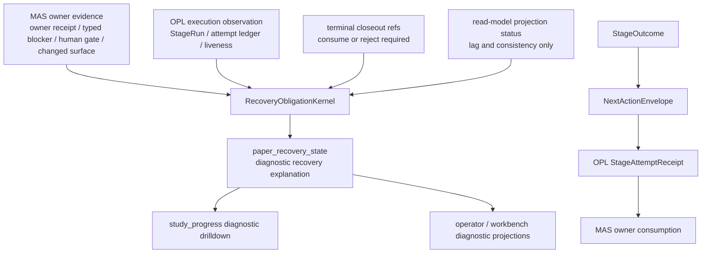

# PaperRecovery Obligation 目标架构

Owner: `MedAutoScience / OPL Framework`
Purpose: `paper_recovery_obligation_target_architecture`
State: `superseded_diagnostic_design`
Machine boundary: 本文是人读目标架构与迁移说明。机器真相归 `contracts/paper_recovery_kernel_contract.json`、源码、测试、fresh `study_progress`、Codex CLI route judgment、owner receipt、typed blocker、human gate、route-back evidence 和 canonical changed surface refs；OPL current-control / attempt ledger 只提供 transport evidence。

2026-06-30 supersession note：本文描述的是 `StageOutcome -> NextActionEnvelope` 收敛前的 PaperRecovery obligation 目标架构。当前默认 next action 不再由 `paper_recovery_state`、`current_work_unit`、provider admission 或 domain-handler export 选择；这些面只能作为 diagnostic / provenance / readback support，不能生成默认 next action、provider admission、paper progress、publication-ready 或 submission-ready 结论。

Reader rule：本文不是 active implementation plan。下文的接口、迁移顺序和验证命令只保留为 historical target/provenance，说明旧 split-control-plane 如何被理解；当前新工作不得从本文恢复 PaperRecovery default selector、provider-admission path、exact-id authority 或 legacy progress fallback。

## 结论

DM002 / DM003 暴露的反复卡点不是单个 reducer 分支漏判，而是多个 projection / selector / export 面各自重新解释 currentness。当前目标态已经收敛为：

`StageOutcome -> NextActionEnvelope -> OPL StageAttemptReceipt -> MAS owner consumption`

PaperRecovery 只保留为诊断/恢复解释层：可以解释 owner receipt、typed blocker、human gate、route-back evidence、transport receipt 和历史 projection 为什么不能推进，但不能替代 `NextActionEnvelope` 生成默认下一步。

## Historical diagnostic call graph

`paper_recovery_state` 不再是默认 next-action decision root。OPL 的 StageRun / queue / attempt ledger / worker lifecycle 是 execution transport evidence；MAS 的 StageOutcome / owner receipt / typed blocker / quality gate / human gate / route-back evidence 是 domain authority。

## Superseded diagnostic interface

输入族：

- `mas_owner_evidence`：current owner delta、owner receipt、quality gate receipt、stable typed blocker、human gate、route-back evidence、canonical changed surface refs。
- `opl_execution_observation`：StageRun lease、attempt ledger、Temporal/provider liveness、worker/source readout。
- `terminal_closeout_refs`：同 identity terminal closeout、accepted/rejected refs、stage log accounting refs。
- `manual_or_human_gate_refs`：manual foreground adoption refs、human/operator decision refs。
- `read_model_projection_status`：projection consistency、stale/lag evidence、diagnostic refs。

Historical diagnostic 输出曾固定为 `paper_recovery_state`，phase 只能是合同允许的互斥枚举：`owner_action_ready`、`admission_pending`、`admission_blocked`、`attempt_running`、`terminal_closeout_ready`、`owner_answer_consumed`、`domain_blocked`、`human_gate`、`projection_inconsistent`、`manual_foreground_unadopted`。当前这些枚举不能越过 canonical `NextActionEnvelope` 或 MAS owner-consumption 结果。

## Superseded derived-surface rules

Legacy 派生面若仍为 replay/provenance 消费该 shape，必须满足 `consume_only_no_redecide_currentness`：

- 读取 `recovery_obligation_id`、`phase`、`conditions`、`next_safe_action`、`current_work_unit_identity`、`provider_admission_identity`、`terminal_closeout_refs` 和 `consumed_or_rejected_refs`。
- 缺任一关键输入时进入 `projection_inconsistent` 或 `admission_blocked`，不得补造 provider admission。
- `domain_handler_export.pending_family_tasks` 只能来自 kernel 输出的合法 provider admission identity，不能从旧 persisted dispatch 或 queue residue 反推。
- `current_work_unit` / `current_execution_envelope` 只负责 historical diagnostic 展示，不重新选择 recovery obligation 或 default next action。

## OPL 基座边界

OPL 已经应承担并持续强化以下 substrate：

- selected stage packet currentness identity：`dispatch_ref`、`stage_packet_ref`、`selected_dispatch_ref`、`stage_packet_refs`。
- StageRun attempt idempotency：`route_identity_key` 和 `attempt_idempotency_key` 原样进入 StageRun。
- terminal closeout transport precedence：terminal/accepted closeout 只作为 execution evidence，等待 MAS consume/reject。
- worker source stale restart guard：只在 Temporal reachable、attempt ledger readable、无 active attempt 时允许 supervisor repair。

MAS 不继续在私有 runtime 中裁判 StageRun currentness、queue residue、terminal precedence 或 worker restart。MAS 只负责 emit 完整 provider admission identity、拒绝弱 identity、消费 terminal closeout 为 owner receipt / typed blocker / next owner，且永不签 OPL runtime lifecycle claim。

## 外部经验映射

- Kubernetes controller：desired/current/status 分离；`current_owner_delta` 是 desired root，OPL StageRun 是 current，conditions/status 不能生成 desired。
- Temporal：event history 和 activity retry 是 durable execution evidence；provider completion 不等于 MAS domain acceptance。
- AWS idempotent APIs：caller intent 必须由显式 idempotency key 表达；同 action label 不构成同一请求。
- Azure CQRS：read model 可滞后，但要显式投影 evidence status；read-model refresh 不能作为 domain progress。
- Google SRE retry budget：同一 identity 无进展 redrive 必须有预算，耗尽后转 successor obligation / human gate / stable typed blocker。

## Historical migration notes

旧迁移方向曾包括 decision fixture、current-work-unit/domain-diagnostic 共用 kernel、domain-handler export consume-only、operator/workbench phase projection 和 selector 退役。2026-06-29 之后，这些不再作为 active backlog 逐项执行；当前 cleanup 只保留 no-resurrection guard，并把仍有价值的行为迁到 `StageOutcome -> NextActionEnvelope`、OPL StageAttemptReceipt readback 或 MAS owner-consumption surface。

## Historical verification

下列命令是历史验证线索，不是当前完成门：

- `python3 -m pytest tests/test_paper_recovery_kernel_contract.py -q`
- `make test-paths -- tests/test_paper_recovery_kernel_contract.py -q`
- `make test-meta`

历史行为验证口径：

- `current_work_unit`、domain diagnostic provider admission、domain-handler export 对同一 fixture 给出同一 phase / next safe action。
- 缺 `route_identity_key`、`attempt_idempotency_key`、stage packet refs 或 owner-route currentness basis 时，provider admission 被 suppress。
- terminal closeout 未被 MAS consume/reject 时，只进入 `terminal_closeout_ready`，不产生 paper progress。
- stop-loss 同一 obligation 无 successor / human gate 时保持 fail closed。

当前验证应改查 [Next Action Control Plane](../control/next_action_control_plane.md)、legacy active path tombstones、fresh `study_progress` / `paper-mission inspect`、OPL StageAttemptReceipt readback、MAS owner receipt、typed blocker、human gate、route-back evidence 或 artifact delta。
