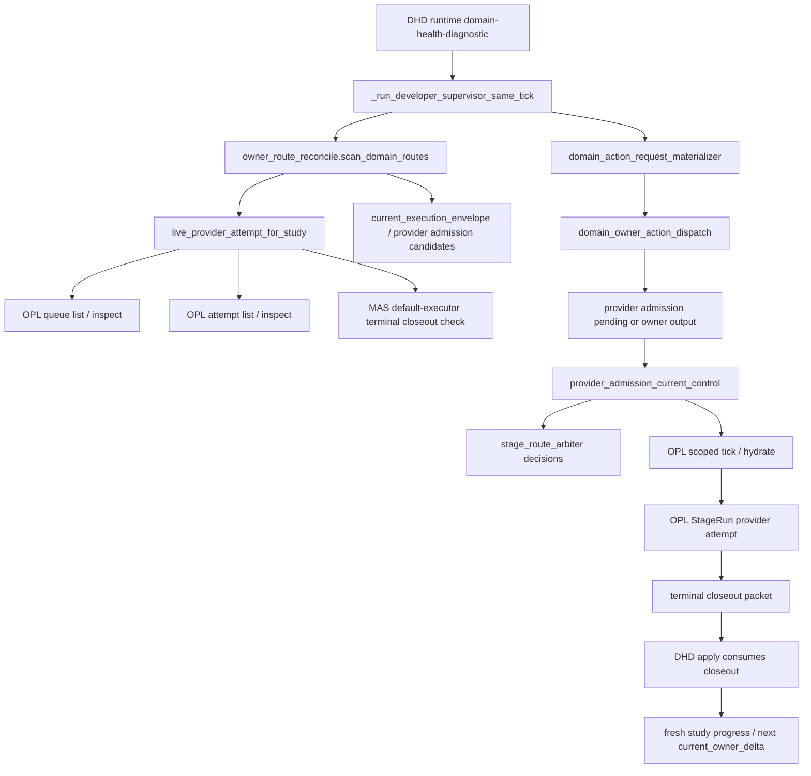
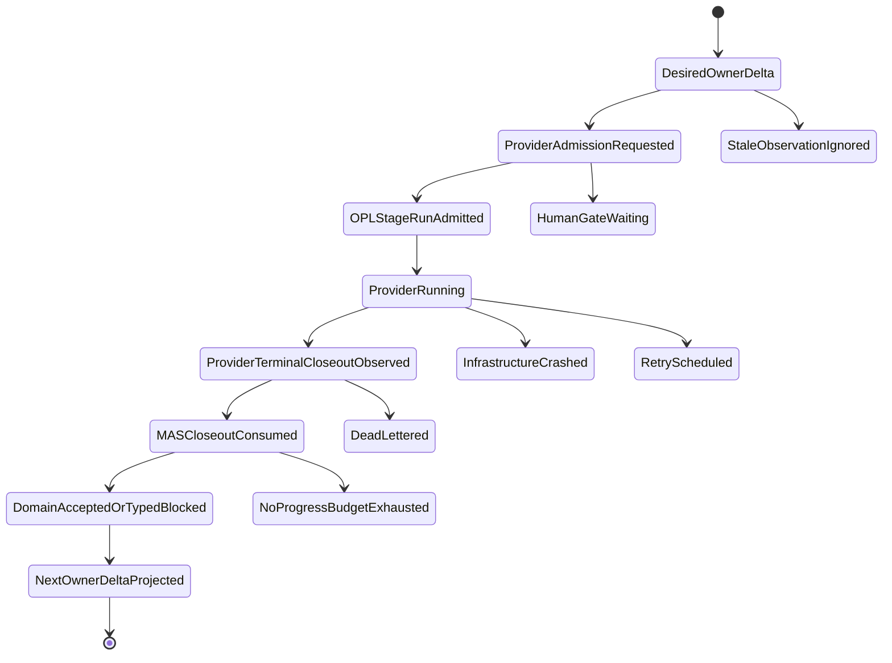

# Stage-route reconcile 目标设计

Owner: `MedAutoScience / OPL Framework`
Purpose: `stage_route_reconcile_target_design`
State: `active_target_design`
Machine boundary: 本文是人读设计说明。机器真相归 `contracts/stage_route_reconcile_contract.json`、`contracts/stage_run_kernel_profile.json`、`contracts/progress_first_safety_envelope.json`、源码、测试、OPL runtime 输出、MAS owner receipt / typed blocker / quality gate receipt / human gate / route-back evidence。
Date: `2026-06-11`

## 目标结论

MAS / OPL stage-route 的理想态是一条幂等 reconcile 链，而不是多套状态面互相解释：

`current_owner_delta -> provider_admission_identity -> OPL StageRun attempt -> terminal closeout -> MAS consume closeout -> next current_owner_delta`

OPL 承接 durable execution、queue、retry、dead-letter、provider liveness、human gate transport、state index、observability 和 workbench；MAS 承接医学 truth、current owner、source/data readiness、publication quality、artifact mutation authority、owner receipt、typed blocker、quality gate receipt 和 human gate 语义接收。

## 当前调用图

风险集中在三处：

- OPL queue / attempt 仍显示 live，但同一 stage attempt 已有 MAS terminal closeout，导致假 running。
- OPL accepted typed closeout 已经覆盖同一 identity，但 provider admission pending 继续回显，导致重复 tick。
- 同一 work unit 多次 terminal / no-op / owner-output-current，没有产生 owner receipt、stable typed blocker、route-back 或 paper/gate/package semantic delta，导致原地打转。

## Stage Route Arbiter

`stage_route_arbiter` 是 DHD current-control refresh 同步输出的机器 surface。它不新增 authority，也不替代 `current_owner_delta`；它只解释每个 provider admission identity 为什么被保留或被抑制：

- `running_identity_observed`：同一 identity 已有 strict live provider attempt，pending 被压制。
- `accepted_closeout_consumed_pending`：同一 identity 已有 accepted typed closeout 或 executed typed blocker，pending 被压制。
- `pending_provider_admission`：没有匹配 live attempt，也没有匹配 accepted closeout，pending 保留，下一步可由 OPL scoped tick / hydrate 接手。

这个 surface 的价值是把原先散落在 live attempt、accepted closeout、pending candidate 过滤里的判断变成单一审计读面。监督线程、operator 和后续 OPL 基座可以直接读 `stage_route_arbiter_decisions[]`，不用再从 action_queue 是否为空倒推原因。它的 authority boundary 固定为 currentness projection only：不能写 study truth、publication verdict、owner receipt、typed blocker、paper body、current package 或 OPL runtime artifact。

## 目标状态机

`ProviderRunning` 必须同时满足 OPL live proof、同一 current owner identity、无同 stage attempt terminal closeout。`ProviderTerminalCloseoutObserved` 只是 transport terminal；只有 `MASCloseoutConsumed` 后，才能进入 `DomainAcceptedOrTypedBlocked` 或 `NextOwnerDeltaProjected`。

## Currentness 优先级

1. 同一 `stage_attempt_id` 的 terminal closeout 压过 OPL live 投影。
2. 同一 current identity 的 strict live provider attempt 压过 provider admission pending。
3. 同一 identity 的 accepted typed closeout 消费 provider admission pending。
4. fresh current owner action 投影为 executable owner action。
5. current identity 的 stable typed blocker 投影为 typed blocker。
6. 旧 route-back、旧 queue、旧 active run、旧 sidecar、旧 lineage 只进 audit。

弱匹配不得授权路线。至少要匹配 study、action、work-unit id / fingerprint、dispatch ref 或 stage attempt 之一的强身份；只有 action type 相同不能压过 pending 或 blocker。

## Anti-loop 预算

同一 `study_id + action_type + work_unit_id + work_unit_fingerprint + source_eval_id` 进入预算桶。以下情况累计 no-progress：

- terminal closeout 后 MAS 没消费出新 current owner delta。
- consumed identity 仍显示 provider admission pending。
- OPL tick 返回 idempotent no-op 且没有新 owner delta。
- owner output already current 但没有 next owner。
- gate replay 反复给出同一 blockers。
- stale route-back 又被投成 current。
- advisory-only refs 没有被 owner 消费。
- queue dead-letter 没有 MAS typed blocker 或 next owner。

预算耗尽后，停止自动 redrive，输出 MAS typed blocker candidate 或 route-back evidence。不能继续靠同一 tick / heartbeat / automation prompt 重复跑。

## Stage Log 最小可用性

每个 terminal closeout 必须把“执行了什么”和“是否推进论文”拆开：

- `paper_stage_log` 是 MAS canonical domain log；`user_stage_log` 与 `stage_log_summary` 只是可等价投影的 alias。
- 显式 domain log 必须包含 stage 目标、实际做了什么、paper 做了什么、stage / paper changed surfaces、outcome、remaining blockers、duration、token usage、cost、usage/cost refs、progress_delta_classification、deliverable / paper / platform delta、next forced delta 和 evidence refs。
- duration / token / cost 未采到时必须写成 explicit missing，例如 `status=missing`、`value=null` 和 missing reason；不能用空对象或猜测值。
- 显式 user-facing stage log 缺 required fields 时，MAS 消费 terminal closeout 为 `domain_closeout_provided_incomplete_user_stage_log` typed blocker；该状态不给 paper-progress credit，不自动 redrive。
- 没有显式 stage log 的旧 closeout，只允许 MAS 从结构化 owner receipt / typed blocker / repair evidence 派生 fallback read-model log，用于兼容历史 closeout；fallback 不升级为论文语义真相。

OPL 的 `stage_progress_log.user_stage_log` 只投影 domain-provided semantic summary、duration/token/cost observed/missing 状态和 refs；OPL 不从 artifact body、memory body、publication verdict body 或 transcript 中自行生成“论文做了什么”。

## Transport Payload 边界

Temporal / queue / workflow state 中只放小 payload：

- 保留：`stage_attempt_id`、idempotency key、closeout refs、consumed refs、memory/writeback refs、rejected writes summary、next owner、domain-ready verdict、route impact、authority boundary、trace/span refs。
- 禁止：paper/user stage log body、transcript、paper/manuscript body、artifact body、memory body、large detail arrays、publication verdict body。

完整正文只保存在 MAS/OPL 文件和 ledger 中，由 refs 连接。这样做的目的不是“压缩日志”，而是防止 provider 已写 closeout 但 Temporal completion 因 payload 过大失败，从而再次制造假 running / pending / terminal 分裂。

## OPL 基座优化

OPL 侧应把以下能力做成一等基座接口：

- `StageRun Kernel`：attempt identity、lease、retry、dead-letter、resume、terminal closeout hook。
- `Route Reconciler`：只消费 MAS desired route / current owner delta，生成 next safe transport action。
- `State Index Kernel`：保存 refs、fingerprint、cursor、checksum、bounded preview hash，不保存医学 truth 或 artifact body。
- `HumanGateTransport`：resume token、timeout、same work-unit binding。
- `Observability Plane`：trace / metric / log / failure class / no-progress budget，不签 domain verdict。
- `Workbench Shell`：默认只显示 current owner、paper/evidence/artifact progress、human gate、next safe action；audit detail drilldown。

OPL 只读基座核查显示，`current_owner_delta` 默认读根、StageRun launch / closeout admission、attempt ledger terminal observation、stop-loss anti-spin foundation 和 `worker_source_stale` supervised restart guard 已经有承接面。还需要在 OPL 合同和回归测试中提升五个一等能力：

- `terminal_closeout_precedes_live_projection`：identity matched terminal typed closeout / owner receipt 必须压过 stale running/live projection；identity mismatch fail closed 为 currentness blocker。
- `stage_run_currentness_identity`：把 `stage_run_id`、generation、manifest/current pointer、source/domain fingerprint、idempotency key、provider attempt、lease、authorization、workflow/task 收成统一 packet，避免各层用散落 label 比对。
- `no_progress_budget_contract`：把 repeat threshold、reset condition、typed-blocker escalation 和 automatic-redrive stop 写进 schema 和测试，不只留在实现分类里。
- `worker_source_stale_supervisor_projection`：保留 fail-closed，但 operator 读面要明确只有 Temporal reachable、attempt ledger readable、无 active attempt 时才可 supervisor-safe restart。
- `trace_span_correlation_refs`：给 `current_owner_delta -> StageRun -> attempt ledger -> Temporal workflow -> ToolResultEnvelope -> owner answer` 统一 refs-only trace/span context，不进入 ordinary planning 或 domain authority。

MAS 侧对应收薄：

- 保留 owner receipt signer、typed blocker materializer、quality gate receipt validator、source/data readiness verdict、artifact mutation authorization。
- 不再新增 generic queue、private scheduler、worker residency owner、第二 route table 或第二 active backlog。
- 外部 capability 默认 fail-open，只能产出 refs-only advisory / repair hint / reviewer briefing；命中 current hard gate 后也只能升级为 typed blocker candidate，由 MAS owner 物化。

## 成熟工程经验映射

- Temporal：借鉴 durable history、retry、signal/query、idempotent activity 和 payload limit；provider completion 仍只是 transport evidence，activity result 必须 refs-only。
- Kubernetes controller：借鉴 desired/current/status/conditions reconcile；read-model 和 worklist 不能成为第二 truth。
- Argo Workflows：借鉴 exit handler、retry strategy、archive 和 memoization边界；archive 不等于 evidence body 或 authority ledger。
- Airflow：借鉴 XCom small metadata boundary；artifact body、memory body、study truth 不进入 task metadata。
- Step Functions / Durable Functions：借鉴 deterministic orchestrator、callback token、execution identity / idempotency 和 redrive 从失败点继续；human answer 必须由 MAS authority surface 消费。
- OpenLineage / OpenTelemetry：借鉴 lineage、span links 和 observability 分层；lineage/trace 不能关闭 quality gate 或 publication verdict。

这些映射的 machine-readable source refs 归 `contracts/stage_route_reconcile_contract.json`；当前采用的官方来源包括 [Kubernetes Controllers](https://kubernetes.io/docs/concepts/architecture/controller/)、[Temporal Activity return values](https://docs.temporal.io/develop/typescript/activities/basics)、[Temporal limits](https://docs.temporal.io/cloud/limits)、[Argo retry/exit handlers](https://argo-workflows.readthedocs.io/en/latest/walk-through/retrying-failed-or-errored-steps/)、[Airflow XComs](https://airflow.apache.org/docs/apache-airflow/stable/core-concepts/xcoms.html)、[AWS Step Functions StartExecution](https://docs.aws.amazon.com/step-functions/latest/apireference/API_StartExecution.html)、[OpenTelemetry traces](https://opentelemetry.io/docs/concepts/signals/traces/) 和 [OpenLineage specification](https://openlineage.io/docs/spec/object-model/)。

## 运行态监督链

1. `study progress --format json`
2. `runtime domain-health-diagnostic --request-opl-stage-attempts --dry-run`
3. OPL queue / attempt / current-control readback
4. 若当前 attempt terminal，则 DHD apply 消费 closeout
5. fresh `study progress`
6. 若是新 identity 的 provider admission pending，再 OPL scoped tick / hydrate

不能用旧 `active_run_id`、transport succeeded、queue completed、zero worklist 或 automation heartbeat 文案判断论文进展。
