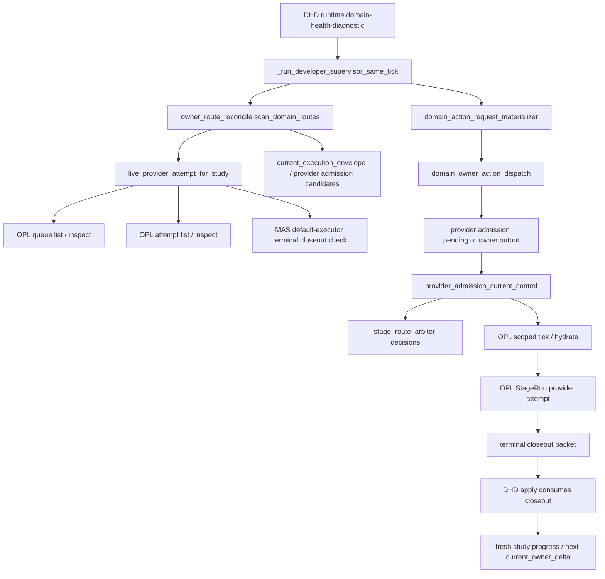
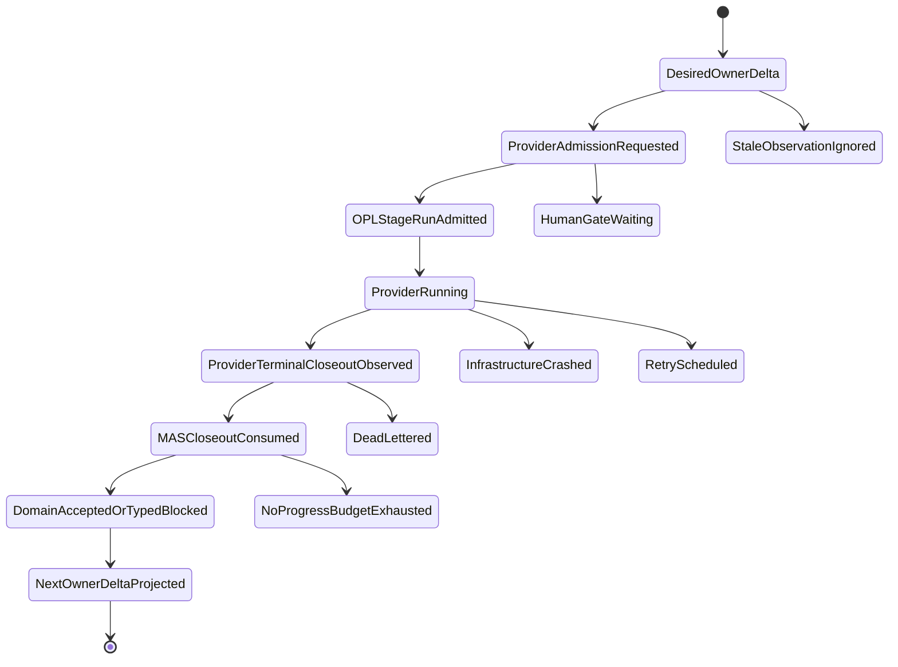

# Stage-route reconcile 目标设计

Owner: `MedAutoScience / OPL Framework`
Purpose: `stage_route_reconcile_target_design`
State: `active_target_design`
Machine boundary: 本文是人读设计说明。机器真相归 `contracts/stage_route_reconcile_contract.json`、`contracts/stage_run_kernel_profile.json`、`contracts/progress_first_safety_envelope.json`、源码、测试、OPL runtime 输出、MAS owner receipt / typed blocker / quality gate receipt / human gate / route-back evidence。
Date: `2026-06-11`

## 目标结论

MAS / OPL stage-route 的理想态是一条幂等 reconcile 链，而不是多套状态面互相解释：

`current_owner_delta -> provider_admission_identity -> OPL StageRun attempt -> terminal closeout -> MAS consume closeout -> next current_owner_delta`

OPL 承接 durable execution、queue、retry、dead-letter、provider liveness、human gate transport、state index、observability 和 workbench；MAS 承接医学 truth、current owner、source/data readiness、publication quality、artifact mutation authority、owner receipt、typed blocker、quality gate receipt 和 human gate 语义接收。

## 当前调用图

风险集中在三处：

- OPL queue / attempt 仍显示 live，但同一 stage attempt 已有 MAS terminal closeout，导致假 running。
- OPL accepted typed closeout 已经覆盖同一 identity，但 provider admission pending 继续回显，导致重复 tick。
- 同一 work unit 多次 terminal / no-op / owner-output-current，没有产生 owner receipt、stable typed blocker、route-back 或 paper/gate/package semantic delta，导致原地打转。

## Stage Route Arbiter

`stage_route_arbiter` 是 DHD current-control refresh 同步输出的机器 surface。它不新增 authority，也不替代 `current_owner_delta`；它只解释每个 provider admission identity 为什么被保留或被抑制：

- `weak_provider_admission_identity`：provider admission carrier 缺 `study_id` / `action_type` / work-unit id / fingerprint / dispatch ref / strong currentness basis 时，pending fail-closed，不进入 OPL tick。
- `running_identity_observed`：同一 identity 已有 strict live provider attempt，pending 被压制。
- `terminal_closeout_precedes_live_projection`：同一 stage attempt / run 已有 accepted typed closeout 或 executed typed blocker，即使 OPL live 读面仍残留 running，也必须先压制 provider admission pending；同一 decision 另带 `stale_running_projection_effect=suppress_stale_running_projection`，明确 stale live 投影也被压制。
- `accepted_closeout_consumed_pending`：同一 identity 已有 accepted typed closeout 或 executed typed blocker，pending 被压制。
- `pending_provider_admission`：没有匹配 live attempt，也没有匹配 accepted closeout，pending 保留，下一步可由 OPL scoped tick / hydrate 接手。

这个 surface 的价值是把原先散落在 live attempt、accepted closeout、pending candidate 过滤里的判断变成单一审计读面。监督线程、operator 和后续 OPL 基座可以直接读 `stage_route_arbiter_decisions[]`，不用再从 action_queue 是否为空倒推原因。它的 authority boundary 固定为 currentness projection only：不能写 study truth、publication verdict、owner receipt、typed blocker、paper body、current package 或 OPL runtime artifact。

arbiter decision 必须同时输出 identity 与 no-progress 读面。所有 decision 至少带 `decision`、`effect`、study / action / work-unit identity、`route_identity_key`、`attempt_idempotency_key`、`evidence_status` 和 authority boundary。若同一 identity 被 terminal / repeat-suppressed / owner-output-current closeout 压住，decision 还要输出 `no_progress_signal` 与 `anti_loop_classification`，例如 `same_work_unit_repeat_suppressed_terminal_stage` / `provider_admission_echo`。operator 不能再从 `provider_admission_pending_count=0` 或 `action_queue=[]` 猜原因。

Provider admission carrier 不能自证 currentness。只要 status 已经声明了 `current_owner_delta` / `current_work_unit` / `current_executable_owner_action` / `current_execution_envelope` 语境，但 canonical identity 不完整，DHD 必须抑制 current-control action 自带的 `owner_route_currentness_basis` fallback。queue / dispatch / action carrier 只能运输 refs，不能在 canonical identity 缺失时反向授权自己成为 current route。

same-tick materialized dispatch 也不能靠同名 `action_type + work_unit_id` 授权 provider admission。只有当前 owner action 或 current work unit 自身带 explicit work-unit fingerprint、action fingerprint、source ref 可嵌入 candidate fingerprint，或 strong owner-route currentness basis（source eval / truth epoch / runtime epoch）时，same-tick candidate 才能留下。缺这些身份时，DHD 只保留 current execution envelope 读面，抑制 same-tick provider admission candidate。

Provider admission 的机器身份必须同时带 `route_identity_key`、`attempt_idempotency_key` 和 strong `owner_route_currentness_basis`。`action_id` 只表示 action family，不能作为 dedupe、route 或 attempt identity。没有 fingerprint 的 stop-loss closeout 只能在 `source_eval_id`、`truth_epoch` 或 `runtime_health_epoch` 与 candidate currentness basis 匹配时消费 pending；否则只能作为旧 stop-loss diagnostic，不能压掉新 source/eval 产生的 provider admission。

Record-only owner refs 是 closeout evidence，不是 currentness identity。`owner_receipt_ref`、`record_ref` 或 `publication_eval_record_ref` 可以证明 provider 产出了 refs-only owner answer，但只有 closeout 自身带原生 work-unit fingerprint / action fingerprint、route / attempt idempotency key、或与 candidate 相同的 `owner_route_currentness_basis` / `source_eval_id` / truth+runtime epoch 时，才能消费 provider admission pending。candidate-root closeout scan 只能补 `action_type` 和 `work_unit_id` 这类弱上下文，不能把 candidate 的 fingerprint、source eval 或 epoch 反填进 closeout 来制造 accepted identity；缺这些 identity 的 record-only closeout 保留为 audit evidence，pending 继续交给 current owner path。

外部成熟工程经验映射到本设计时，采用 identity-first 而不是 status-first。Temporal 的 [Event History](https://docs.temporal.io/encyclopedia/event-history/) 是 durable workflow replay evidence，Temporal [Activity idempotency](https://docs.temporal.io/activity-definition) 要求 retry 具备稳定 identity；AWS Builder's Library 的 [Making retries safe with idempotent APIs](https://aws.amazon.com/builders-library/making-retries-safe-with-idempotent-APIs/) 用 caller intent / client request identifier 支撑安全重试；Azure Architecture Center 的 [CQRS pattern](https://learn.microsoft.com/en-us/azure/architecture/patterns/cqrs) 把 write model 与 read model 分账，并要求读面接受 eventual consistency；Google SRE 的 [Handling Overload](https://sre.google/sre-book/handling-overload/) 把 retry 纳入 overload / budget 治理。对应到 MAS/OPL：`route_identity_key` / `attempt_idempotency_key` / `owner_route_currentness_basis` 是 caller intent + receiver dedupe identity，OPL StageRun / Temporal status 是 durable execution evidence，MAS closeout consumption 才是 domain currentness transition；任何缺 identity 的 record-only ref、transport completion、queue empty 或 worker heartbeat 都只能进 audit。

## 目标状态机

`ProviderRunning` 必须同时满足 OPL live proof、同一 current owner identity、无同 stage attempt terminal closeout。`ProviderTerminalCloseoutObserved` 只是 transport terminal；只有 `MASCloseoutConsumed` 后，才能进入 `DomainAcceptedOrTypedBlocked` 或 `NextOwnerDeltaProjected`。

2026-06-13 追加维护规则：stage-route 调用关系的机器入口是 `contracts/stage_route_reconcile_contract.json#/stage_route_call_graph`，人读渲染入口是 `docs/runtime/contracts/stage_route_contract.md#stage-route-invocation-graph`。这张图把 `current_owner_delta -> current_work_unit -> current_execution_envelope -> provider_admission_current_control -> OPL StageRun -> terminal closeout -> DHD apply -> MAS owner receipt / typed blocker -> next current_owner_delta` 固定为同一 identity 的单向链，并把 trace/span、old active run、typed-blocker-only、provider completion 和旧 persisted dispatch 到 authority surface 的反向边列为 forbidden edges。后续修复若要改变 stage-route/currentness 行为，必须先更新这张机器图和 meta test，再落到具体 reducer / selector / projection；不要只靠调整某个分支顺序来隐式改变整体调用图。

## Currentness 优先级

1. 弱 provider admission identity 直接 fail-closed 为 currentness diagnostic，不进入 pending。
2. 同一 `stage_attempt_id` 的 terminal closeout 压过 OPL live 投影。
3. 同一 current identity 的 strict live provider attempt 压过 provider admission pending。
4. 同一 identity 的 accepted typed closeout 消费 provider admission pending。
5. weak fresh progress current-owner ticket 只投影 diagnostic，不进入 default executor dispatch。
6. fresh current owner action 投影为 executable owner action。
7. current identity 的 stable typed blocker 投影为 typed blocker。
8. 旧 route-back、旧 queue、旧 active run、旧 sidecar、旧 lineage 只进 audit。

弱匹配不得授权路线。至少要匹配 study、action、work-unit id / fingerprint、dispatch ref 或 stage attempt 之一的强身份；只有 action type 相同不能压过 pending 或 blocker。same-tick materialized dispatch 的约束更强：同名 action 与同名 work unit 仍然不足以授权 provider admission，必须额外有 explicit fingerprint、source ref 或 owner-route currentness basis。

2026-06-11 追加实现规则：MAS 内部所有“当前 action 是否能压过 stale blocker / handoff / provider admission residue”的判断统一走 `stage_route_currentness_identity` helper。该 helper 只提取 `action_type`、`work_unit_id`、`work_unit_fingerprint` / `action_fingerprint` 与 `owner_route.source_refs.owner_route_currentness_basis`，不做业务优先级裁决。repair-progress follow-up 这类会打开 OPL authorization blocker 的路径必须共享 fingerprint；只有同 action 或同浅层 label 不足以授权 redrive。

2026-06-12 追加实现规则：canonical `current_work_unit.status=typed_blocker` / fresh `current_execution_envelope.typed_blocker` 先于旧 `domain_transition` 和 stale current-control queue 裁决。旧 transition 只能在没有 fresh typed blocker、或存在同 currentness identity 的合法 readiness/repair follow-up action 时参与 materialization；否则进入 ignored diagnostic。fresh typed blocker 可以阻断旧 transition、queue 和 persisted dispatch，但不能自我升级为 owner action；`complete_medical_paper_readiness_surface` 只能来自显式 `current_executable_owner_action`、带 authority binding 的 stage-native next action，或 `terminal_closeout_owner_answer_required` closeout dispatch。terminal workflow completed、queue completed 或 default executor `handoff_ready` 不能越过 MAS typed blocker，不能被写成 paper progress。

2026-06-12 追加实现规则：`study_progress.current_owner_ticket` 只有在 `owner_route.source_refs.owner_route_currentness_basis`、`current_executable_owner_action`、`current_work_unit` 或 ticket work-unit 中带 strong source / work-unit / action fingerprint 或 `source_eval_id` 时，才能生成 owner route 和 dispatch。`study-progress-current-owner-ticket::*` 这类 synthetic id 只能作为 action id，不能当作 currentness fingerprint。缺 strong identity 时输出 `fresh_progress_current_owner_ticket_requires_strong_currentness_identity` diagnostic，`default_dispatch_allowed=false`，并由 selector 作为 ignored diagnostic 处理。

## Anti-loop 预算

同一 `study_id + action_type + work_unit_id + work_unit_fingerprint + source_eval_id` 进入预算桶。以下情况累计 no-progress：

- terminal closeout 后 MAS 没消费出新 current owner delta。
- consumed identity 仍显示 provider admission pending。
- OPL tick 返回 idempotent no-op 且没有新 owner delta。
- owner output already current 但没有 next owner。
- gate replay 反复给出同一 blockers。
- stale route-back 又被投成 current。
- advisory-only refs 没有被 owner 消费。
- queue dead-letter 没有 MAS typed blocker 或 next owner。

预算耗尽后，停止自动 redrive，输出 MAS typed blocker candidate 或 route-back evidence。不能继续靠同一 tick / heartbeat / automation prompt 重复跑。

DHD scoped scan 只对本次 `--studies` 范围产生 active action queue。未扫描 study 的历史 handoff / provider admission residue 必须保留在 audit payload，例如 `unscanned_action_queue_retained_for_audit`，但不得进入 top-level active `action_queue`、不得增加 `provider_admission_pending_count`、不得触发 OPL tick。这条规则避免局部 dry-run / apply 因旧 study residue 把当前 owner 误判为还有可启动 provider task。

## Stage Log 最小可用性

每个 terminal closeout 必须把“执行了什么”和“是否推进论文”拆开：

- `paper_stage_log` 是 MAS canonical domain log；`user_stage_log` 与 `stage_log_summary` 只是可等价投影的 alias。
- 显式 domain log 必须包含 stage 目标、实际做了什么、paper 做了什么、stage / paper changed surfaces、outcome、remaining blockers、duration、token usage、cost、usage/cost refs、progress_delta_classification、deliverable / paper / platform delta、next forced delta 和 evidence refs。
- duration / token / cost 未采到时必须写成 explicit missing，例如 `status=missing`、`value=null` 和 missing reason；不能用空对象或猜测值。
- 显式 user-facing stage log 缺 required fields 时，MAS 消费 terminal closeout 为 `domain_closeout_provided_incomplete_user_stage_log` typed blocker；该状态不给 paper-progress credit，不自动 redrive。
- 没有显式 stage log 的旧 closeout，只允许 MAS 从结构化 owner receipt / typed blocker / repair evidence 派生 fallback read-model log，用于兼容历史 closeout；fallback 不升级为论文语义真相。

OPL 的 `stage_progress_log.user_stage_log` 只投影 domain-provided semantic summary、duration/token/cost observed/missing 状态和 refs；OPL 不从 artifact body、memory body、publication verdict body 或 transcript 中自行生成“论文做了什么”。

`stage_log_workbench_summary` 是给 agent/operator workbench 的最小可用 read-model：从 `paper_stage_log` 派生 stage goal、actual work、paper / deliverable / platform delta、observability、evidence refs、next forced delta、missing domain fields 和 source refs 的字段状态、计数、refs 与下一步指针。它必须是 `refs_only_body_free`：不复制 `stage_work_done` / `paper_work_done` 正文，不带 paper body、artifact body、memory body、publication verdict body 或 transcript body；authority 固定为 observability-only，不能写 paper truth、声明 domain-ready、授权 quality verdict，也不能新增 blocking preflight。

## Transport Payload 边界

Temporal / queue / workflow state 中只放小 payload：

- 保留：`stage_attempt_id`、idempotency key、closeout refs、consumed refs、memory/writeback refs、rejected writes summary、next owner、domain-ready verdict、route impact、authority boundary、trace/span refs。
- 禁止：paper/user stage log body、transcript、paper/manuscript body、artifact body、memory body、large detail arrays、publication verdict body。

完整正文只保存在 MAS/OPL 文件和 ledger 中，由 refs 连接。这样做的目的不是“压缩日志”，而是防止 provider 已写 closeout 但 Temporal completion 因 payload 过大失败，从而再次制造假 running / pending / terminal 分裂。

## OPL 基座优化

OPL 侧应把以下能力做成一等基座接口：

- `StageRun Kernel`：attempt identity、lease、retry、dead-letter、resume、terminal closeout hook。
- `Route Reconciler`：只消费 MAS desired route / current owner delta，生成 next safe transport action。
- `State Index Kernel`：保存 refs、fingerprint、cursor、checksum、bounded preview hash，不保存医学 truth 或 artifact body。
- `HumanGateTransport`：resume token、timeout、same work-unit binding。
- `Observability Plane`：trace / metric / log / failure class / no-progress budget，不签 domain verdict。
- `Workbench Shell`：默认只显示 current owner、paper/evidence/artifact progress、human gate、next safe action；audit detail drilldown。

OPL 只读基座核查显示，`current_owner_delta` 默认读根、StageRun launch / closeout admission、attempt ledger terminal observation、stop-loss anti-spin foundation、`stage_run_currentness_identity`、terminal closeout precedence、schema-backed no-progress budget 和 `worker_source_stale` supervised restart guard 已经有合同 / 实现 / 回归测试承接面。MAS 侧对应职责是消费这些 refs 与 identity，不再把它们列为 OPL 未落地缺口：

- `terminal_closeout_precedes_live_projection`：identity matched terminal typed closeout / owner receipt 必须压过 stale running/live projection；identity mismatch fail closed 为 currentness blocker。
- `stage_run_currentness_identity`：把 `stage_run_id`、generation、manifest/current pointer、source/domain fingerprint、idempotency key、provider attempt、lease、authorization、workflow/task 收成统一 packet，避免各层用散落 label 比对。
- `no_progress_budget_contract`：把 repeat threshold、reset condition、typed-blocker escalation 和 automatic-redrive stop 写进 schema 和测试，不只留在实现分类里。
- `worker_source_stale_supervisor_projection`：保留 fail-closed，但 operator 读面要明确只有 Temporal reachable、attempt ledger readable、无 active attempt 时才可 supervisor-safe restart。
- `trace_span_correlation_refs`：给 `current_owner_delta -> StageRun -> attempt ledger -> Temporal workflow -> ToolResultEnvelope -> owner answer` 统一 refs-only trace/span context，不进入 ordinary planning 或 domain authority。

2026-06-12 追加 OPL 基座优化：StageRun identity / read-model 必须原样嵌入 MAS `provider_admission_identity`、`provider_admission_identity_key`、`route_identity_key`、`attempt_idempotency_key` 和 `owner_route_currentness_basis`。OPL 可以派生 transport labels，但 launch、liveness、closeout、owner-answer 和 replay 决策必须能从 MAS identity 原样读回；不能只依赖 OPL 自己生成的 `mas_default_executor_source` stable id。

2026-06-12 追加 MAS 消费规则：`contracts/stage_route_reconcile_contract.json` 已把 OPL covered 项拆到 `opl_covered_and_mas_consumes`，剩余 MAS 消费缺口为空；trace/span refs 与 `desired/current/status` reconcile 另有机器策略和 meta test。desired 只来自 MAS `current_owner_delta` / `current_work_unit`，current 只来自 StageRun lease、attempt ledger、Temporal/workflow liveness 和 terminal closeout，status 只记录 conditions、no-progress budget、trace refs 和 next safe transport action。worker heartbeat、quest running、queue completed、transport succeeded、archive materialized 和旧 active run 都不能直接驱动 desired state。无 active attempt 且 source stale 时可以由 supervisor restart worker；有 active attempt、attempt ledger 不可读或 Temporal 不可达时只能 fail-closed 为 supervisor diagnostic。

2026-06-12 追加 Progress-first admission 投影规则：`owner_action_admission` 是 admission / readiness 读面，只要 reducer 仍有 `current_executable_owner_action` 就必须生成；它不能被“是否作为顶层 executable owner action 显示”的 visibility 规则挡掉。旧 active run / handoff ref 可以被清成 non-running，但同一 fresh current action 的 admission pending、hard-gate blocked 或 provider-running-proof 字段仍要可见，避免 operator 因 `owner_action_admission=null` 误判为没有下一步。

2026-06-12 追加 Runtime supervision operator policy：OPL 侧已有 source-stale restart fence、StageRun identity、terminal precedence 和 no-progress budget，MAS 侧必须把这些基座能力投影成集中 operator 决策表。`runtime_supervision_operator_policy` 把 current-control 四态固定为 desired / running / terminal / read_model：desired 只来自 MAS current owner；running 只来自同 identity 的 StageRun lease + provider/Temporal liveness；terminal 只来自同 identity terminal closeout refs；read_model 只是可重建投影。`domain-health-diagnostic --dry-run` 是 observe-runtime-truth，可以刷新诊断 evidence，但不启动 provider、也不能声称 no-write；`domain-health-diagnostic --apply` 只能在 dry-run 已证明 terminal closeout 或 matching current-control identity 后消费 closeout / materialize current-control；`provider-slo tick` 只做 provider health / worker repair，不消费 MAS handoff；`family-runtime tick --hydrate` 只有在 materialized provider admission pending、worker ready/source-current、无 matching live attempt、无 matching terminal closeout 时才可启动 StageRun。worker source stale restart 只能在 Temporal reachable、attempt ledger readable、无 active attempt 时执行；否则 fail closed 为 supervisor diagnostic。

MAS 侧对应收薄：

- 保留 owner receipt signer、typed blocker materializer、quality gate receipt validator、source/data readiness verdict、artifact mutation authorization。
- 不再新增 generic queue、private scheduler、worker residency owner、第二 route table 或第二 active backlog。
- 外部 capability 默认 fail-open，只能产出 refs-only advisory / repair hint / reviewer briefing；命中 current hard gate 后也只能升级为 typed blocker candidate，由 MAS owner 物化。

## 成熟工程经验映射

- Temporal：借鉴 durable event history、deterministic replay、retry、signal/query、idempotent activity 和 payload limit；provider completion 仍只是 transport evidence，activity result 必须 refs-only。
- Kubernetes controller：借鉴 desired/current/status/conditions reconcile；read-model 和 worklist 不能成为第二 truth。
- Argo Workflows：借鉴 exit handler、retry strategy、archive 和 memoization边界；archive 不等于 evidence body 或 authority ledger。
- Airflow：借鉴 XCom small metadata boundary；artifact body、memory body、study truth 不进入 task metadata。
- Step Functions / Durable Functions：借鉴 deterministic orchestrator、callback token、execution identity / idempotency、execution history 和 redrive 从失败点继续；human answer 必须由 MAS authority surface 消费。
- OpenLineage / OpenTelemetry：借鉴 lineage、span links 和 observability 分层；lineage/trace 不能关闭 quality gate 或 publication verdict。

这些映射的 machine-readable source refs 归 `contracts/stage_route_reconcile_contract.json`；当前采用的官方来源包括 [Kubernetes Controllers](https://kubernetes.io/docs/concepts/architecture/controller/)、[Temporal Activity return values](https://docs.temporal.io/develop/typescript/activities/basics)、[Temporal limits](https://docs.temporal.io/cloud/limits)、[Temporal event histories](https://docs.temporal.io/workflows#event-history)、[Argo retry/exit handlers](https://argo-workflows.readthedocs.io/en/latest/walk-through/retrying-failed-or-errored-steps/)、[Airflow XComs](https://airflow.apache.org/docs/apache-airflow/stable/core-concepts/xcoms.html)、[AWS Step Functions StartExecution](https://docs.aws.amazon.com/step-functions/latest/apireference/API_StartExecution.html)、[AWS Step Functions GetExecutionHistory](https://docs.aws.amazon.com/step-functions/latest/apireference/API_GetExecutionHistory.html)、[OpenTelemetry traces](https://opentelemetry.io/docs/concepts/signals/traces/) 和 [OpenLineage specification](https://openlineage.io/docs/spec/object-model/)。

2026-06-11 的补充经验映射：Temporal / Conductor 一类 durable workflow 强调 history、retry、timeout 和 idempotent execution；Step Functions 的 redrive / StartExecution 也要求 execution identity 与 idempotency 边界；Dagster 的 declarative automation 把触发条件收成可审计条件，而不是让长 heartbeat 自行完成业务修复。MAS / OPL 对应规则是：`current_owner_delta` 是 desired state，stage-route arbiter 是统一 reconcile decision，自动化只触发短 tick / observe / supervisor handoff，不能替代 closeout consumption 或 domain owner receipt。

## 运行态监督链

1. `study progress --format json`
2. `runtime domain-health-diagnostic --request-opl-stage-attempts --dry-run`
3. OPL queue / attempt / current-control readback
4. 若当前 attempt terminal，则 DHD apply 或等价 MAS authority consumer 消费 closeout
5. fresh `study progress`
6. 若是新 identity 的 provider admission pending，且该 pending 已 materialized 到 current-control，再 OPL scoped tick / hydrate

不能用旧 `active_run_id`、transport succeeded、queue completed、zero worklist、provider-slo healthy、worker heartbeat 或 automation heartbeat 文案判断论文进展。provider-slo 的成功只说明 provider/worker 健康；hydrate 的成功也只说明 StageRun admitted / running watch，仍不等于 paper progress。paper progress 只来自 MAS owner receipt、quality gate receipt、canonical changed surface ref、stable typed blocker、human gate 或 route-back evidence。

2026-06-12 只读监督口径：若 fresh `study progress` 和 DHD dry-run 同时显示 `active_run_id=null`、`running_provider_attempt=false`、`provider_admission_pending_count=0`、`provider_admission_candidates=[]` 和 `action_queue=[]`，则 operator 必须判为没有 active provider work。DM002 / DM003 的具体 blocker、owner、action、work unit 和 fingerprint 不能从本文或合同样本读取，必须按 live readback 判定。`anti_loop_budget_exhausted` 类 outcome 是 terminal stop-loss / typed owner outcome；`medical_paper_readiness_missing`、`medical_publication_surface_blocked`、`stage_packet_not_current_selected_dispatch` 类 outcome 是当前 typed-blocker 恢复入口。后续只能由对应 owner 产出 owner receipt、typed blocker 解除、human/operator gate、route-back 或新 work-unit identity，不能靠 heartbeat 或同一 `run_quality_repair_batch` redrive 前进。
